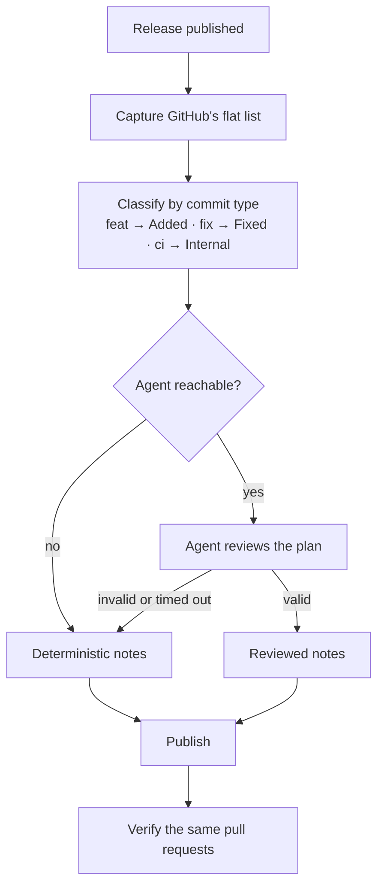

# Release Notes

The release workflow publishes with GitHub-generated release notes, so every
MeshLLM release starts life as one flat `## What's Changed` list. A normal minor
release carries a few hundred entries in merge order, which buries the handful
of changes a reader actually needs. The `release_notes` job in `release.yml`
regroups that list into
[Keep a Changelog 1.1.0](https://keepachangelog.com/en/1.1.0/) sections right
after publication.

This skill formats notes that already exist. It does not decide release
readiness or build the change inventory from source; that is
[`release-validation`](../release-validation/SKILL.md).

## Ground Rules

- **Move entries; the only edit is the type prefix.** The renderer strips a
  known conventional type from the front of a subject and sentence-cases what
  follows, because the type already chose the section and repeating it reads
  inconsistently beside entries that never had one. A subject with no
  recognised prefix is left exactly as written -- an unrecognised `word:` may
  be part of the sentence, as in "Durable KV prefix cache: agent prefixes
  survive eviction". Nothing else about a subject changes.
- **Never touch the credit.** The ` by @<author> in <url>` tail is copied
  through byte for byte, and the set of referenced pull requests is the
  invariant every gate checks.
- **Never drop an entry.** Every merged PR credits a contributor, including the
  CI and build churn. Noisy entries collapse into `### Internal`, never deleted.
- **Keep the tail.** `## New Contributors` and the `**Full Changelog**` link
  stay exactly as GitHub generated them.
- **Never guess a section.** An entry the commit metadata cannot place goes to
  `### Other changes`. A wrong section is worse than an honest unsorted one,
  and misfiling a security fix as a routine fix is the worst case.
- **Editing a published release is a public change.** Outside the release job,
  show the regrouped body and get explicit approval before `gh release edit`.

## How The Pipeline Works

Two passes, in this order. The first always runs and always produces a
publishable body; the second is best-effort.



The gate in steps 2, 3 and 5 is one rule: **the set of referenced pull
requests must not change**. Sections move, subjects lose their type prefix,
but no PR is dropped, duplicated, or invented, and author credit is copied
through untouched. Nothing publishes unless that holds.

### 1. Deterministic pass (authoritative)

`scripts/release-notes-classify.py` reads the canonical squash-merge commits
between the comparison base and the tag, and maps each entry by its
[Conventional Commits](https://www.conventionalcommits.org/en/v1.0.0/) type:

| Type | Section |
|---|---|
| `feat` | Added (Changed when `!` or `BREAKING CHANGE:`) |
| `fix` | Fixed |
| `perf`, `revert` | Changed |
| `security` | Security |
| `ci`, `build`, `deps`, `chore`, `test`, `refactor`, `style`, `docs` | Internal |
| anything else, or no conventional subject | Other changes |

Two rules override the type. A tooling scope — `ci`, `release`, `build`,
`deps`, `xtask`, `bench`, `just` — is Internal whatever the type, because a
`fix(ci)` repairs CI rather than the product. A `Release-Notes: <Section>`
commit trailer wins outright, and is the escape hatch when the type cannot
express the change.

`scripts/release-notes-regroup.py` then renders the plan, refusing unless it
covers the body exactly.

### 2. Agent review pass (optional, best-effort)

`scripts/release-notes-generate.sh` probes for a reachable agent and, only if
one answers, asks it to review the deterministic plan — chiefly the
`Other changes` entries and any security-relevant fix committed as a plain
`fix`. Its output goes through the same validation and entry-set gate as the
deterministic plan.

The agent is optional by construction. Missing CLI, absent credentials, failed
probe, exhausted quota, blown time budget, unparseable plan, or a plan that
fails validation each log a reason and keep the deterministic notes. None of
them fail the job. `AGENT_MODEL` is unset by default, so the pipeline ships
deterministic-only until a runner provides the CLI and credentials.

## Running It By Hand

The job does this automatically for stable releases. Run it yourself to
reformat an older release or to recover from a bad edit:

```bash
RELEASE_TAG=v0.76.0 RELEASE_NOTES_BASE=v0.75.1 DRY_RUN=true \
  scripts/release-notes-generate.sh
```

`DRY_RUN=true` renders and gates without touching the release. Publishing from
a manual run additionally needs `RELEASE_NOTES_APPROVED=true`, so a hand run
cannot edit a published release by accident; the release job sets no such
variable because `GITHUB_ACTIONS` already marks it automated. The work directory keeps `body.backup.md`; restore with
`gh release edit <tag> --notes-file body.backup.md`.

To hand-classify instead, list the entries, write a plan, and render:

```bash
python3 scripts/release-notes-regroup.py --body body.md --list
python3 scripts/release-notes-regroup.py --body body.md --plan plan.json --out new.md
```

The plan assigns every PR number to a section:

```json
{
  "version": "0.76.0",
  "date": "2026-09-10",
  "sections": [
    {
      "title": "Added",
      "groups": [{ "title": "Serving and inference", "prs": [1228, 1439] }]
    },
    { "title": "Removed", "prs": [1399] }
  ],
  "internal": {
    "summary": "CI, build, test, and repository work with no user-facing behavior change",
    "groups": [{ "title": "CI and release engineering", "prs": [1244] }]
  }
}
```

A section takes either a flat `prs` list or `groups`. Section order follows
Keep a Changelog, then `Other changes`, then `Internal`. Omit empty sections.

Always prove no pull request was dropped, duplicated, or invented. Entry lines
are not byte-identical after prefix stripping, so compare the PR set:

```bash
diff <(grep -o 'pull/[0-9]*' body.backup.md | sort) \
     <(grep -o 'pull/[0-9]*' new.md | sort) \
  && echo "identical pull-request sets"
```

## Judgement Calls

Conventional-commit prefixes are a strong hint, not the whole answer. When
reviewing a plan by hand or as the agent pass:

- A `perf:` PR is **Changed**. Keep a Changelog has no performance section, and
  a speedup changes existing behavior.
- A `fix:` PR that closes an exposure is **Security**, not Fixed. Classify by
  what the change protects. This is the single most valuable correction to make,
  because the commit type cannot express it.
- A `feat:` PR that replaces an existing subsystem is **Changed**, not Added.
- A docs PR that documents a removal sits beside the removal; a docs PR that
  publishes a new reference is **Added**; everything else docs-shaped is
  **Internal**.
- A revert and its later re-land both stay, in the section the change belongs
  to. The history is the point.
- Reviewer follow-up PRs ("address review findings for #1478") sit with the
  change they fix up.

## Layout

- Sub-headings appear automatically in any section past 20 entries, one per
  scope with at least 4 entries, smaller scopes merged into `Other`. Below that
  a flat list reads better.
- `### Internal` goes last, wrapped in `<details>` with a `<summary>` stating
  the count. Keep a blank line after `<summary>` or GitHub will not render the
  Markdown inside it.

## Improving Coverage

Every entry the deterministic pass cannot classify is a commit that did not
follow Conventional Commits. `scripts/hooks/commit-msg` rejects those locally
(`just hooks-install`), `just check-commits` validates a range, and the
`Check commit convention` step in the Quality lane enforces the pull request
title in CI, which is the part that binds contributors who never install the
hook. Because the
repository squash-merges, the PR title becomes the commit subject, so the PR
title is what has to be conventional.

Coverage is a measurable property of a release:

```bash
python3 scripts/release-notes-classify.py --body body.md \
  --range v0.75.1..v0.76.0 --version 0.76.0 --date 2026-09-10 --out plan.json
# classified 182/272 entries deterministically (90 in 'Other changes')
```

v0.76.0 predates the hook and classifies 182 of 272. Releases made entirely
under the hook should approach full coverage, leaving the agent pass with only
genuine judgement calls.
