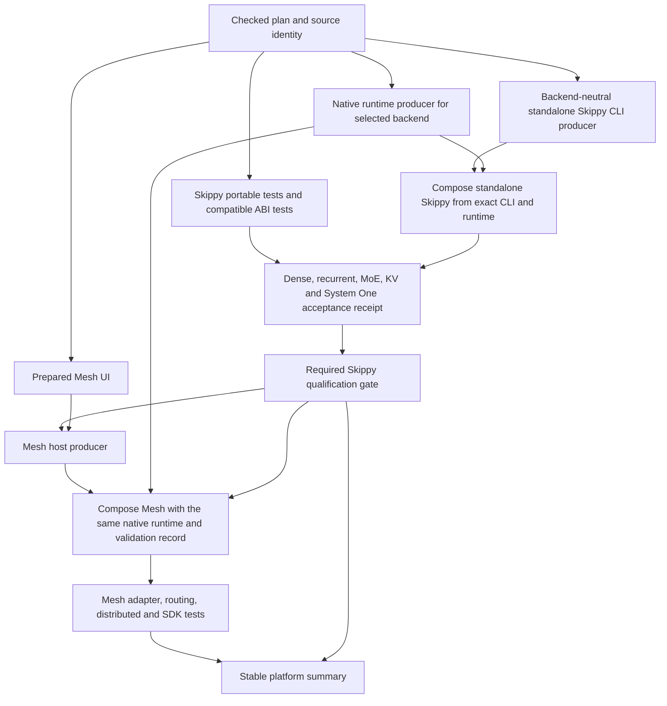
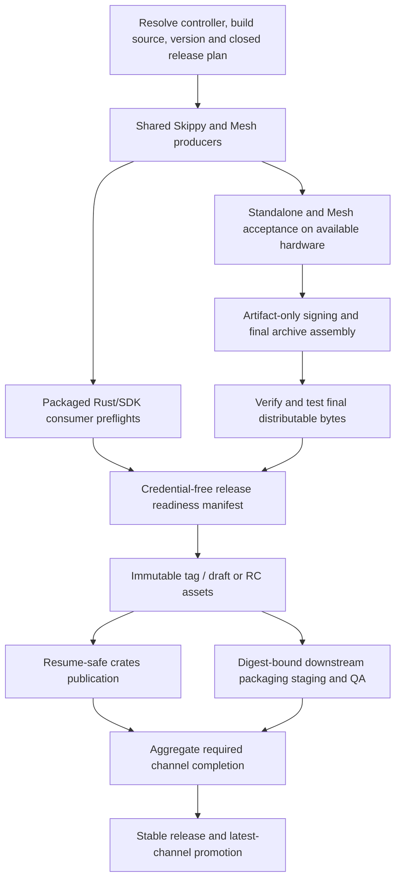

# CI and release audit: Skippy first, verified artifacts, complete platform testing

Audit date: 5 October 2026. This document is an implementation plan, not a change to the current CI contract. No workflows, runner settings, release assets, or repository variables were changed during the audit.

The findings and before/after comparisons preserve the original source and run snapshots listed in section 2. Before this documentation PR was prepared, the standalone product split merged in [PR #2099](https://github.com/Mesh-LLM/mesh-llm/pull/2099). The PR base, `9ca2aacaa698746becc811ec304d19de788c9d1e`, includes the standalone CLI producers/archive additions and verified release-runtime restoration in ordinary crates preflight and publication. Those additions are present in source; the standalone acceptance gates, pre-publication readiness and complete release process proposed here still need implementation. Recheck deployed behavior and successful execution evidence when implementing each phase.

## Advantages of the redesign

The biggest gain is **confidence that the binaries we ship work—and that Mesh works with those exact binaries**.

- **Earlier, clearer failures.** Skippy inference, cache, or API failures are caught before Mesh builds and integration tests. That makes diagnosis easier and avoids wasted downstream work.
- **Stronger inference coverage.** Dense, recurrent, MoE, KV cache, System One, and Decisions become explicit acceptance gates rather than coverage inferred from a successful build.
- **Consistent artifact testing.** Standalone Skippy and Mesh exercise the same native runtime bytes, catching packaging, ABI, and library-loading problems that unit tests can miss.
- **A tested standalone CLI release.** Skippy becomes an independently validated deliverable alongside MeshLLM, with CLI archives, compatible native runtime artifacts, checksums, and provenance. Publish the exact validated CLI bytes; verify final distribution bytes after signing or packaging changes.
- **Safer releases.** Package verification happens before publication, and release completion tracks GitHub assets, crates, and downstream packages. This addresses the partial-release failure observed in this audit.
- **Honest platform reporting.** Unavailable hardware lanes remain defined and build-tested, with explicit inference skips. They can start executing when hardware becomes available.
- **Less duplicated work and drift.** Shared producers and harnesses keep PR, main, and release behavior aligned.
- **Less workflow maintenance.** Normal trusted builds can populate useful caches; retire redundant warmers and migration scaffolding once their replacements are verified.

The redesign can also save compute through artifact reuse and suppressing downstream work after failures. Total CI time needs measurement: making Mesh wait for Skippy may increase the successful-run critical path.

## Before and after

- **Workflow layout. Before:** five visible PR workflows and five main workflows, backed by reusable platform/topic lanes. **After:** preserve those entrypoints and check names; add Skippy-first dependencies inside each platform lane.
- **Skippy build and test order. Before:** the local branch builds the standalone CLI inside UI-dependent Mesh host jobs, without a standalone acceptance gate. **After:** produce Skippy independently of Mesh UI, run its applicable qualification suites, and require the resulting gate before Mesh host work.
- **Artifact handoff. Before:** native runtimes feed Mesh composition, but the standalone CLI artifact has no ordinary downstream test consumer. **After:** compose and test standalone Skippy, then hand Mesh the same runtime bytes and explicit validation records; consumers never rebuild missing inputs.
- **Inference acceptance. Before:** routine product smokes principally cover dense/recurrent Mesh inference and Laya, with uneven platform coverage. **After:** all nine core rows define dense, recurrent, MoE, KV cache, System One and Decisions suites, executing on available hardware.
- **Hardware scheduling. Before:** CUDA/ROCm/Vulkan execution coverage differs by OS and several rows are build-only or optionally skipped. **After:** preserve build/package checks everywhere; create all execution lanes, accept planned hardware-unavailable skips, and require tests once a row is enabled. Vulkan shares each OS's CUDA/ROCm pools.
- **Rust coverage. Before:** planned package membership can conceal `skippy-ffi` executor skips, and SafeTensors smoke is PR-only. **After:** reconcile actual executed packages with the plan, give FFI a compatible graph, and run selected SafeTensors coverage consistently on PR/main.
- **Standalone releases. Before:** the earlier protected main snapshot did not publish standalone Skippy CLI archives; the audited branch added archive production without complete qualification, now merged through PR #2099. **After:** release the independently tested CLI alongside compatible runtimes, checksums and provenance, with final-byte checks.
- **Release preflight. Before:** crates verification occurs after GitHub publication and can skip packages whose new dependencies are unpublished. **After:** verify the selected staged package DAG and native link closure before public publication; run the same credential-free readiness in canary mode.
- **Signing and identity. Before:** compilation shares jobs with private signing material and release producers do not all bind source identity the same way. **After:** resolve source/variant identity once, isolate artifact-only signing, and verify final archives and the generated tag delta.
- **Release completion. Before:** dispatch acknowledgement counts as the upstream packaging handoff, while crates and downstream channels can complete independently. **After:** bind the dispatch to the release manifest, collect terminal per-channel receipts, and promote stable/latest only after all applicable requirements succeed.
- **Recovery and performance. Before:** ordinary and recovery publication prepare native verification differently; broad matrix barriers and duplicate work obscure the critical path. **After:** share verification preparation, resume immutable missing outputs, reduce measured duplication/barriers, and retain honest timing/cost evidence.
- **Cache publication. Before:** dedicated Linux and Windows warmers compile graphs separately from normal validation. **After:** successful trusted Windows runtime producers save exact ABI caches; retire its warmer after verified handoff. Harvest compatible Linux compiler outputs from required trusted builds if measured savings justify it, then retire the separate Linux warmer; retain it until that replacement is proven.
- **Workflow cleanup. Before:** an inert migration shim and separate/dormant Docker validation workflows remain in the inventory. **After:** remove the shim after protected compatibility migration and move Docker validation into ordinary changed-file Quality coverage, then remove its two workflow files. Preserve distinct qualification, recovery and deployment responsibilities.

The [complete workflow inventory](#14-workflow-inventory-current-and-proposed-behavior) below lists every checked-in workflow in this repository, plus every workflow in the two supporting repositories inspected for this pipeline. Each row states its current role and proposed disposition.

## 1. Recommendation

Keep the five visible Quality, Website, Linux, macOS, and Windows PR/main workflows. Within each platform lane, make standalone Skippy a first-class producer with its own tests and qualification result. Mesh then consumes the exact Skippy runtime artifacts and their validation records, including hardware qualification where available. Release uses the same producers and test harnesses, validates the final distributable bytes, and publishes only after all applicable required preflights succeed.

The requested core support matrix is:

| OS | Architecture proposed for the initial contract | Backends |
|---|---|---|
| Linux | amd64 | CPU, CUDA, ROCm, Vulkan |
| Windows | amd64 | CPU, CUDA, ROCm, Vulkan |
| macOS | arm64 | Metal |

The architecture column reflects today's ordinary product lanes; the original request specified OS/backend, so this is an explicit planning assumption. Existing Linux arm64, CUDA version variants, Apple SDK targets, and Node addon targets remain supported release surfaces until a separate decision changes them. Nine core lanes do not imply nine total release artifacts.

Every core lane should define dense, recurrent, MoE (mixture-of-experts), KV cache, System One, and Decisions acceptance. Dense, recurrent, and MoE model execution belong in standalone Skippy qualification before Mesh consumes the tested artifacts. Hardware-dependent execution runs only when approved matching hardware is available.

The hardware execution policy reflects the maintainer-confirmed absence of Linux ROCm, Windows ROCm and Windows CUDA hardware. Vulkan reuses available CUDA or ROCm machines on the same OS, with the Vulkan driver/loader configured and a device preflight before inference:

| Lane | Hardware inference policy |
|---|---|
| Linux CPU | Run when selected |
| Windows CPU | Run when selected |
| Linux CUDA | Run when selected on the existing approved NVIDIA role |
| macOS Metal | Run when selected on the existing Metal role |
| Linux ROCm | Define the complete test lane now; skip hardware execution until approved hardware is available |
| Windows ROCm | Define the complete test lane now; skip hardware execution until approved hardware is available |
| Windows CUDA | Define the complete test lane now; skip hardware execution until approved hardware is available |
| Linux Vulkan | Run when selected on the available Linux CUDA pool, or an available Linux ROCm pool; verify the Vulkan driver/device before testing |
| Windows Vulkan | Define the complete test lane now; run when either Windows CUDA or Windows ROCm hardware is available, with a Vulkan driver/device preflight |

Keep build, packaging, ABI/import and no-driver checks active for all selected artifact rows. Hardware-unavailable tests are planned, explained skips that do not block CI or release. Report them as `hardware-unavailable`, never as inference passes. Once a lane is enabled, its selected tests become required: test failures, unexpected skips, or runner loss must fail rather than being reclassified as unavailable hardware.

All nine requested combinations are already present in the ordinary build matrix. The main change is therefore what those builds prove and when consumers may run. It is a substantial graph and coverage change, but it can reuse much of the existing infrastructure. Artifact composition and verification are already strong. The largest missing pieces are standalone qualification, hardware execution on several lanes, and a release completion contract spanning all publication channels.

## 2. Scope, evidence, and limits

The audit inspected the local workflow inventory, reusable platform graphs, producer/composer actions, planner manifests and fixtures, runner/cache policy, smoke scripts, model manifests, publication scripts, product guidance, and release documentation. A structural census found 69 local workflow files and 227 declared jobs before matrix expansion. These counts measure graph size, not useful coverage.

The audited source identities must be distinguished:

| Evidence | Immutable identity |
|---|---|
| Local source audited | `e0e58f9e11df0633d7e24caf788d4117c310a75c` on `scammed/skippy-standalone-pr` |
| Protected main observed | `a3a173f13ee486d348ed6be770ae065d85435494` |
| Downstream packaging source inspected | `Mesh-LLM/mesh-packaging@3a9dd1da7b2fdf25ab706e1cf0dec75fc777b61e` |
| Runner-image workflow source inspected for the inventory | `Mesh-LLM/mesh-llm-runner-images@6c220ce1ed39d57c3fd67d60ee9554f83f0cf2e2` |

Local source includes the physical Skippy/Mesh extraction and standalone CLI artifact additions. The protected main snapshot inspected before PR #2099 merged did not contain all of those additions. Findings about those artifacts distinguish the audited branch from that earlier deployed workflow. The PR base now includes the split and ordinary crates runtime-restoration changes described above; their presence does not establish successful execution of the proposed acceptance suites. Historical logs also use pre-extraction package names, including `skippy-server`.

Read-only GitHub inspection covered recent runs, the latest published release, downstream packaging results, repository rulesets, selected non-secret repository variables, and repository runner registration. Organization runner-group configuration returned HTTP 403. Runner-group restrictions, provider isolation, organization-level variables and detailed fleet configuration remain unverified. The maintainer subsequently confirmed that Linux ROCm, Windows ROCm and Windows CUDA hardware is unavailable today; the plan therefore makes those execution lanes conditional. A repository runner count of zero does not prove there are no organization or ephemeral runners. Queued runs alone do not prove a capacity problem.

The plan follows the [manage-ci contract](../.agents/skills/manage-ci/SKILL.md), [current inventory](../.agents/skills/manage-ci/references/current-inventory.md), [topology](ci.md), and [PR/main composition specification](../.omo/specs/pr-ci-optimization.md). These remain the authoritative current rules; implementation must update them together when the rules change.

Live main rules require the five PR lane contexts. The inspected rule had strict status checking disabled and no required approving-review count, with maintainer bypasses. Those are observed governance settings, not changes proposed by this audit. The redesign should preserve the required check names; release readiness must enforce its own source-bound evidence rather than assuming branch protection proves all release jobs ran.

## 3. Behavior at the audit snapshot

### 3.1 PR and main

There are exactly five required PR entrypoints and five routine main entrypoints. The planner selects affected PR work; main selects the exhaustive graph. PRs execute protected-main reusable lane definitions against candidate product source. Main uses same-commit lane definitions. Stable lane summaries validate planned results and permit intentional unselected work to skip.

This architecture is worth retaining: reviewers can navigate platform-specific logs, candidate code does not own privileged runner policy, and routing has a checked, versioned contract. Draft PRs and documentation-only changes can avoid expensive work while still producing stable checks.

Sources: [Linux lane](../.github/workflows/ci-linux-lane.yml), [macOS lane](../.github/workflows/ci-macos-lane.yml), [Windows lane](../.github/workflows/ci-windows-lane.yml), [slice catalog](slices.yml).

### 3.2 Builds and artifact handoff

The ordinary product graph separates:

1. Prepared console UI.
2. Backend-neutral Mesh host, once per OS/architecture.
3. Native Skippy runtime, once per backend row.
4. Composition-only Mesh product.
5. Product smoke tests and SDK consumers.

Hosts and native runtimes are independent producers. Mesh host preparation is gated by UI, not by standalone Skippy acceptance. Product composition waits for both host and runtime producers. At the lane level, matrix jobs introduce broad barriers: CPU composition can wait for every selected backend producer in the same matrix.

The local branch also builds and uploads a backend-neutral standalone Skippy CLI inside each Mesh host producer, before preparing the Mesh binary. This gives compilation order inside that job, but it is not a separate tested Skippy stage. The CLI artifact has no ordinary downstream test consumer in the inspected workflow graph. Its build is also unnecessarily downstream of Mesh UI preparation.

The existing composers verify producer checksums, runtime identity, ABI compatibility, host import policy, expected backend, and product manifests. They copy exact bytes and do not rebuild inputs. No-driver startup/readiness and library closure verification are valuable existing checks.

Sources: [Skippy CLI preparation](../.github/actions/prepare-skippy-cli-input/action.yml), [Linux host producer](../.github/workflows/ci-linux-host-slice.yml), [product preparation action](../.github/actions/compose-product-input/action.yml), [composer](../scripts/compose-product-bundle.py).

### 3.3 Tests and current platform coverage

The following table describes checked-in execution paths, corroborated where noted by completed main runs. “Build” means artifact generation/composition, not inference certification.

| Core lane | Build/composition today | Real product execution today | Main gap |
|---|---|---|---|
| Linux CPU | Yes | Dense/recurrent Mesh inference, OpenAI compatibility, Laya, two-node client, dense/recurrent split KV and durable L3 restart | Standalone Skippy gate; routine MoE acceptance; Decisions; release-wide reuse |
| Linux CUDA | Yes | Dense/recurrent Mesh inference and Laya on NVIDIA hardware | Standalone gate; backend-specific MoE/KV/Decisions; CI/release CUDA parity |
| Linux ROCm | Yes | Conditional Laya only, behind approved AMD runner gate; skipped in observed complete main run | Reliable AMD hardware plus complete inference acceptance |
| Linux Vulkan | Yes | Conditional Laya only, behind Vulkan enablement/device checks; skipped in observed complete main run | Complete dense/recurrent/MoE/KV/System One/Decisions suite on a qualified Vulkan device |
| Windows CPU | Yes | Laya product smoke; platform unit tests/readiness | General dense/recurrent/MoE inference and KV/Decisions acceptance |
| Windows CUDA | Yes | No equivalent full hardware inference suite in the ordinary lane | NVIDIA execution and full acceptance |
| Windows ROCm | Yes | No equivalent full hardware inference suite in the ordinary lane | AMD execution and full acceptance |
| Windows Vulkan | Yes | No equivalent full hardware inference suite in the ordinary lane | Qualified Vulkan execution and complete inference acceptance |
| macOS Metal | Yes | Dense/recurrent Mesh inference, OpenAI compatibility, Laya, Swift SDK smoke | Standalone gate; real MoE/KV/Decisions integration |

Linux and Windows Vulkan are core lanes in this redesign and receive the same suite definitions and artifact handoff requirements as the other backends.

The workflow named “Skippy Inference Smoke Tests” actually executes a composed `mesh-llm` binary. It is useful Mesh product coverage, but it does not prove that the standalone Skippy CLI/package works. Dense and recurrent fixtures are small pinned models; they do not certify every model architecture.

Rust unit/in-process tests already cover significant Skippy serving, frontend, cache, and state behavior. Four deterministic Linux test batches execute packages serially with isolated Cargo invocations. macOS and Windows add selected platform tests, not exhaustive copies of all Linux tests. Planned package membership must be distinguished from actual execution: both the ordinary test loop and Quality Clippy loop explicitly skip `skippy-ffi`.

The SafeTensors runtime smoke is selected only for pull requests. It is skipped on exhaustive main, despite the desired selected-PR/main equivalence. The test is explicitly compiled and invoked rather than merely relying on default ignored-test discovery, which is a good pattern to preserve.

Sources: [inference workflow](../.github/workflows/smoke.yml), [Linux product smokes](../.github/workflows/ci-linux-product-smoke-slice.yml), [Windows product smokes](../.github/workflows/ci-windows-product-smoke-slice.yml), [macOS product smokes](../.github/workflows/ci-macos-product-smoke-slice.yml), [Rust test executor](../.github/workflows/ci-rust-tests-slice.yml), [Quality executor](../.github/workflows/ci-quality-slice.yml), [platform tests](../.github/workflows/ci-platform-checks-slice.yml).

### 3.4 System One and Decisions

System One has several distinct evidence paths:

| Path | What it establishes | What it does not establish |
|---|---|---|
| Laya product parity smoke | Real model answers against goldens through Mesh `/systemone`, on current CPU/CUDA/Metal paths and Windows CPU | Standalone CLI parity, Decisions mapping, full DiffusionGemma support |
| Standalone System One contract smoke | Native route/validation behavior, including typed rejection of a non-reader model | Successful full-read inference on an unsupported backend |
| Full-read DiffusionGemma/OpenJEV smoke in canary | Qualified reader behavior for the explicitly selected backend and pinned model | All nine platform/backend combinations |
| Decisions router tests | Adapter behavior with a fake backend | Real reader equivalence or Mesh routing |
| Existing live Decisions script | Real-model predicate/choice/score response shape through `/v1/decisions` | Automated CI coverage: no workflow wiring was found |

The actual native route is `/systemone`; the Decisions route is `/v1/decisions`. Do not accidentally specify `/v1/systemone` as the valid endpoint.

The full-read smoke can report an unqualified backend and exit successfully unless qualification is required. Its script defaults/comments and canary caller settings are not a universal support declaration. The canary explicitly requires Metal qualification; the script also has configurable certified-backend behavior. A green contract-only run must never be presented as successful reader inference.

Decisions translates predicate to the System One predicate/Noul form, converts choice/score questions, and reshapes the result. It belongs in the System One suite, with both adapter tests and real reader tests. The existing script checks types, labels, probabilities, model identity, and usage shape; it needs stronger semantic and negative assertions.

Sources: [System One smoke](../skippy/scripts/skippy-system-one-smoke.sh), [case driver](../skippy/scripts/skippy-system-one-cases.py), [Laya product smoke](../scripts/ci-laya-smoke.py), [Decisions implementation](../skippy/crates/skippy-inference-api/src/decisions.rs), [router](../skippy/crates/skippy-inference-api/src/router.rs), [Decisions router tests](../skippy/crates/skippy-inference-api/src/router_tests/decisions.rs), [live Decisions script](../scripts/skippy-decisions-smoke.py).

### 3.5 MoE coverage

Skippy already has MoE family parity modules and an [expert smoke harness](../skippy/evals/skippy-moe-expert-smoke.py). The [family catalog](llama-canary/family-certified.json) includes pinned MoE models. However, the ordinary dense/recurrent product smoke does not include a named MoE case, and broad family certification does not establish routine qualification of every shipped platform/runtime artifact.

The existing expert harness inspects expert tensors within a stage range and combines that evidence with cache/state-handoff correctness across runtime lanes. That is useful starting coverage, but tensor presence alone does not prove the requested expert routing executed. Extend the acceptance receipt with actual expert execution evidence where available and staged/full-model parity. Use [Skippy correctness](../skippy/crates/skippy-correctness/README.md) for single-step, chained split and restore comparisons. Keep broader family sweeps on their explicit cadence while defining a representative pinned MoE fixture in every core lane and executing it when that lane's hardware is available.

### 3.6 Nightly and canary

The upstream llama canary has unusually strong immutable candidate handoffs, per-family receipts, independent verification, bounded repair attempts, memory admission, offline model caches, and worker no-rebuild rules. Reuse these evidence patterns. Do not treat a canary built against a candidate pin/static feature graph as certification of a different shipped dynamic runtime.

Nightly KV tests, live public-mesh stability, and trusted agent replay answer different questions. Long-context replay is currently manual-only. Preserve their independent cadence and failure classification rather than folding them all into a small PR smoke.

The optional PR CI canary covers one hosted Linux amd64 CPU UI/host/runtime/product chain. It does not cover the five lane orchestrators, Windows, macOS, GPU execution, SDKs, or release publication.

Sources: [upstream canary](../.github/workflows/llama-upstream-canary.yml), [family pass](../.github/workflows/llama-canary-family-pass.yml), [KV nightly](../.github/workflows/nightly-kv-coverage.yml), [stability nightly](../.github/workflows/nightly-stability.yml), [agent replay](../.github/workflows/agentic-replay-nightly.yml), [PR canary lane](../.github/workflows/ci-pr-canary-lane.yml).

## 4. Release audit

### 4.1 Current release graph

The release workflow is manual dispatch only. Metadata prepares a version commit and fast-forwards main before building. A shared UI artifact feeds the host/SDK producers. Hosts, native runtimes, SDK artifacts, and composers produce a much larger matrix than ordinary CI. Later publication adds generated Swift/binding/SDK resources to the tagged source and publishes GitHub assets. Stable releases then independently publish crates and dispatch downstream packaging.

There is one real release inference call: the Linux CPU composed product smoke. macOS, Windows, CUDA, ROCm, Vulkan, and arm64 release builds do not receive equivalent release-specific hardware inference acceptance. Linux arm64 has artifact/startup/portability smoke, which is useful but not model inference.

The release graph does not require ordinary exhaustive main Quality/tests for the resolved version source before publishing. Reusing producer actions is not enough to establish test equivalence.

The local release workflow has 30 declared top-level jobs, with the major families below:

| Family | Current job IDs / expansion |
|---|---|
| Source/UI | `metadata`, `release_ui` |
| amd64 Linux/macOS hosts and CPU products | `build`, `compose_cpu_products`, `inference_smoke_tests` |
| Shared SDK producers | `build_native_sdk_runtime` (3 rows), `build_node_sdk_addon` (4 rows), `build_swift_sdk_artifact` |
| Base native runtimes | `build_native_runtime` (3 rows: macOS Metal, Linux amd64 CPU, Linux arm64 CPU) |
| Linux GPU runtimes | `build_native_runtime_linux_aarch64_cuda` (2), `build_native_runtime_linux_x86_64_cuda` (2), `build_native_runtime_linux_x86_64_rocm`, `build_native_runtime_linux_x86_64_vulkan` |
| Linux arm64 products | `build_linux_arm64`, `compose_linux_arm64_cpu`, `smoke_linux_arm64_artifact`, `compose_linux_aarch64_cuda` (2) |
| Linux amd64 GPU products | `compose_linux_cuda` (2), `compose_linux_rocm`, `compose_linux_vulkan` |
| Windows products/runtimes | `windows_host_input`, `compose_windows_cpu`, `compose_windows_gpu` (3), `build_native_runtime_windows_cpu`, `build_native_runtime_windows_gpu` (3) |
| Publication | `publish`, `release_notes`, `dispatch_packaging_release`, `publish_crates_preflight`, `publish_crates` |

Twenty-four direct execution jobs omit an explicit job timeout. Reusable callees must be assessed separately; their caller rows do not each need a duplicate timeout.

Source: [release workflow](../.github/workflows/release.yml).

### 4.2 A confirmed partial-release incident

The latest inspected stable release, [v0.78.0](https://github.com/Mesh-LLM/mesh-llm/releases/tag/v0.78.0), demonstrates why publication success needs a wider definition.

| Event on 4 October 2026, UTC | Result |
|---|---|
| GitHub publish completed, about 20:27 | Success |
| Packaging dispatch completed, about 20:27 | Success |
| crates.io preflight completed, about 20:32 | Success |
| crates.io publisher completed, about 21:11 | Failure |
| Downstream packaging run | Success, independently of crates publication |

The [upstream release run](https://github.com/Mesh-LLM/mesh-llm/actions/runs/37226884923) failed while Cargo verified the packaged `skippy-server` binary. The log reports `mold: fatal: library not found: mtmd`, followed by failure to verify the package tarball. This is a native link-closure failure, not a registry rate-limit diagnosis. The [packaging run](https://github.com/Mesh-LLM/mesh-packaging/actions/runs/37232152060) still published its selected outputs successfully.

The separate [resume-crates workflow](../.github/workflows/resume-crates-release.yml) already restored checksummed CPU runtime libraries from the immutable release and provided `LLAMA_STAGE_LIB_DIR`. Ordinary preflight/publication lacked that preparation in the failing release snapshot. [PR #2224](https://github.com/Mesh-LLM/mesh-llm/pull/2224), now included in this documentation PR's base, adds restoration to both ordinary jobs. Verify the fix with a successful package run and share the preparation across ordinary/recovery paths. Preflight still follows GitHub publication, so this landed fix does not complete the proposed release-readiness redesign.

### 4.3 Preflight and source-identity gaps

- Crates preflight happens after public GitHub publication, too late to prevent an incomplete release.
- `publish-crates.sh --dry-run` skips packages whose same-version dependencies are not yet in crates.io. A successful dry-run can therefore omit precisely the packages most likely to fail later. Report the verified/skipped package set and add a local staged-package verification strategy.
- Canary mode skips publishing jobs, including aggregate asset checks/preflights located inside those jobs. It does not exercise the whole non-mutating release readiness contract.
- Host/UI jobs use `metadata.source_sha`; several native/SDK jobs default to the dispatch SHA and prepare versions locally. This is not proof of functional divergence, but it weakens a single immutable source identity and makes provenance comparison harder.
- The final tag includes generated release resources and can differ from the build source commit. Keep build source SHA and final tag SHA as separate identities, then validate the allowed generated delta. Do not label them interchangeably or require impossible raw-SHA equality.
- Release toolchains/runtime variants differ from ordinary CI. Linux ordinary CUDA uses a narrower architecture set; live `CUDA_VERSION=12.8.0` overrides Windows defaults, while release contains separate CUDA variants. ROCm architecture/image sets also differ. A successful ordinary row cannot certify every release runtime.
- Publishing downloads `release-*` with merged directories. Required manifest/archive checks exist, but a complete explicit asset set and collision rejection would provide a stronger boundary than wildcard collection.
- GPU producer skips are accepted in portions of the publication condition. Required/optional status should derive from the selected release profile and be enforced by one readiness validator.

Sources: [publication script](../scripts/publish-crates.sh), [release version owner](../scripts/release-version.sh), [release process](../RELEASE.md), [release topology](ci.md).

### 4.4 Signing, downstream packaging, and SDKs

Host compilation and private signing material currently share jobs. The workflow comments acknowledge this coupling. Separate compilation from signing before expanding provider/cache placement for release work. The signer should consume verified hashes and produce signatures/attestations, with no source compilation.

Downstream packaging is a strong starting point. Its [inspected release workflow](https://github.com/Mesh-LLM/mesh-packaging/blob/3a9dd1da7b2fdf25ab706e1cf0dec75fc777b61e/.github/workflows/images-release.yml) resolves immutable upstream tags, checks producer schema compatibility, verifies product archives and shared host bytes, tests Homebrew installation, assembles/installs the npm tarball, and enforces a readiness result. Its [package/image workflow](https://github.com/Mesh-LLM/mesh-packaging/blob/3a9dd1da7b2fdf25ab706e1cf0dec75fc777b61e/.github/workflows/package-image-row.yml) binds package hashes, SBOM subjects, base-image digests, staged-image digests, and QA evidence. It promotes tested images without rebuilding and records rollback state.

However, the upstream dispatch carries repository/tag/version and publication flags rather than a full evidence identity. The downstream manual expected-SHA input does not currently bind the ordinary repository-dispatch payload. Upstream waits only for dispatch acknowledgement, not downstream readiness. Downstream container QA/readiness without GPU passthrough also does not prove GPU inference.

Node addon archives cover four OS/architecture targets, but the assembled npm runtime smoke is Linux x64. Native addon presence/checksums do not replace install/load tests on Windows, macOS, and Linux arm64. Swift SDK architecture/platform packaging also requires its own framework/resource/load tests; the nine inference lanes should not flatten Apple cross-compilation targets.

### 4.5 Deployment and documentation

The [Pages pipeline](../.github/workflows/website-pages.yml) rebuilds and browser-checks the public site before a separate deploy job. Keep that separation. As standalone Skippy documentation lands, verify that staging copies the new generated routes/assets; the current staging list explicitly copies selected directories and root files. This is a follow-up contract check, not a finding that unpublished pages are already broken.

The [Fly console deployment](../.github/workflows/fly-deploy-console.yml) accepts a ref and performs a remote rebuild under a deployment environment. It is outside the immutable release artifact handoff. Resolve the source once, record the produced image digest, verify health, and record rollback identity if it is intended to participate in release completion. Environment approval settings were not inspected, so no absence of protection is asserted.

The [Docker workflow](../.github/workflows/docker.yml) is manual Dockerfile validation, not release image qualification. Separate that label from downstream tested-image readiness.

Documentation has drift: Mesh product guidance still describes tag-push release execution although `release.yml` is dispatch-only; the release documentation's illustrated crates chain is shorter than the actual publish list. Generate or contract-check these inventories against the owning scripts/catalogs.

## 5. Findings and priority

Priorities describe sequencing, not a formal security severity rating. P0 blocks confidence in the next complete stable release; P1 is required for the proposed support/testing contract; P2 improves efficiency and operability. Source links above establish the inspected code; live links establish observed execution.

| ID | Priority | Finding | Required correction / acceptance |
|---|---|---|---|
| F01 | P0 at original snapshot | Missing native preparation caused normal crates verification failure; ordinary runtime restoration is now present in the PR base | Verify the landed restoration with successful package evidence, share preparation across ordinary/recovery paths, and move verification before publication |
| F02 | P0 | Crates preflight follows GitHub publication and skips dependent packages | Pre-publication staged verification with exact coverage census, including binary crates |
| F03 | P0 | Public channels can complete independently and leave a partial stable release | Durable per-channel release state and aggregate completion; explicit resumable failure handling |
| F04 | P1 | Standalone Skippy CLI artifact has no test consumer | Compose/test standalone Skippy and pass exact artifacts/receipts to consumers |
| F05 | P1 | Mesh host work does not depend on Skippy acceptance | Explicit dependency gate before Mesh product build/integration |
| F06 | P1 | Windows CPU lacks general dense/recurrent/KV product acceptance | Same core executable harness on Windows CPU |
| F07 | P1 | Windows CUDA/ROCm lack the proposed inference suites and have no hardware today | Create complete hardware-gated suites; accept explained hardware-unavailable skips; require execution when enabled |
| F08 | P1 | Linux ROCm has conditional limited coverage and no hardware today | Define the complete gated suite; retain disabled execution until hardware is available; report the coverage gap |
| F09 | P1 | Most release backend variants get no real inference test | Test exact final artifacts wherever approved hardware is available; record unavailable rows without blocking publication |
| F10 | P1 | MoE family coverage does not provide a named routine gate for each shipped backend artifact | Pinned MoE fixture, expert execution evidence, staged/full-model parity and cache restore in standalone qualification |
| F11 | P1 | Decisions real-model smoke exists but is not wired into CI | Include `/v1/decisions` in System One standalone and Mesh suites |
| F12 | P1 | Contract-only System One success can conceal unqualified reader execution | Capability-specific required assertions and separate result states |
| F13 | P1 | `skippy-ffi` is skipped in ordinary tests and Clippy | Dedicated compatible graph, plus executed-package census rather than planned-only census |
| F14 | P1 | SafeTensors test is PR-only | Equivalent selected test on exhaustive main and appropriate release profile |
| F15 | P1 | Source/profile/runtime identity varies across release producers | One resolved source plus explicit generated tag delta; centralized variant catalog |
| F16 | P1 | Signing material shares compilation jobs | Artifact-only signing jobs with narrowly scoped credentials |
| F17 | P1 | Release canary misses aggregate checks inside publishing jobs | Extract credential-free readiness/preflight; use it in canary and publish |
| F18 | P1 | Upstream does not bind/wait for downstream evidence | Dispatch exact identity and digest; correlate downstream terminal receipt |
| F19 | P2 | Matrix barriers delay ready backend consumers | Bounded row-specific chains inside the same visible platform lane |
| F20 | P2 | Windows runtime package lacks the same package-builder handoff | Explicit tooling artifact contract for integration fixture production, without consumer rebuilds |
| F21 | P2 | Release job timeout coverage is incomplete | Measured job/phase deadlines plus cleanup/upload allowance |
| F22 | P2 | SDK install/load coverage differs from archive target coverage | Target-specific addon/framework consumer tests with explicit compatibility floor |
| F23 | P2 | Release asset wildcard aggregation is weaker than exact publication census | Closed asset catalog, duplicate/extra/missing checks, durable provenance manifest |
| F24 | P2 | Live runner variables and documentation can mislead about active policy | Record resolved provider/gate reason; reconcile expired Depot exception and docs |
| F25 | P2 | Deploy rebuild identities are separate from release evidence | Explicit deployment source/image/health/rollback receipt |
| F26 | P2 | Performance/cost decisions lack a sufficiently broad measured cohort | Capture queue/build/test/cache/artifact/hardware timings before tuning capacity |
| F27 | P1 | Vulkan builds lack the complete proposed inference suite: Linux has conditional Laya only; Windows has no equivalent hardware suite | Define full Linux/Windows Vulkan acceptance, gated on an approved verified device; preserve build/package checks when unavailable |
| F28 | P2 | Dedicated cache warmers duplicate compile work; Windows main runtime producers do not save trusted ABI caches | Save verified exact caches from trusted main producers; measure Linux seed replacement before retiring its sole publisher |
| F29 | P2 | Migration scaffolding and separate/dormant Docker validators add maintenance without distinct active acceptance | Remove inert shim after compatibility migration; fold useful Docker checks into selected Quality coverage and retire redundant workflow files |

The P0 and P1 findings are the main correctness and coverage work. Faster caches or more workers should not be the first response to these gaps.

## 6. Proposed platform graph

### 6.1 Graph and ordering

Within each Linux, macOS, or Windows lane:

Standalone Skippy qualification includes dense, recurrent and MoE model execution, KV cache integration, and System One including Decisions. The acceptance gate validates required build/portable checks plus hardware tests enabled by the frozen plan. The full Mesh host producer waits for that gate. Mesh hardware integration consumes the same qualified runtime bytes when execution is enabled; composition and no-driver checks may continue for unavailable hardware rows, with qualification explicitly recorded as `hardware-unavailable`.

UI preparation can run independently because Skippy does not require Mesh UI. Other independent quality checks can run while Skippy builds. “Skippy first” should define producer/test dependencies, not impose a repository-wide serial queue. Do not force one OS to wait for every other OS: preserve the five independent workflow runs.

Build one Skippy CLI and one Mesh host per OS/architecture. Pair them with backend-specific native runtimes. Use a bounded static set of typed backend calls where row-level dependencies are necessary; a single matrix `needs` edge waits for all matrix children and cannot express individual-row completion. Keep the slice catalog small and nesting shallow.

### 6.2 Three distinct test layers

| Layer | Ownership and scope | Gate |
|---|---|---|
| Portable / ABI tests | Skippy unit tests, serialization, API adapters, package parsing, cache state machines; compatible static/dynamic feature graphs | Before qualification; each applicable package actually executed |
| Standalone executable acceptance | Composed Skippy binary plus the exact runtime; real pinned models and external HTTP/process harness | Required for selected rows with approved hardware; planned unavailable rows skip explicitly |
| Mesh integration | Mesh adapter, MoE model routing/splitting, distributed state, protocol, plugins, SDKs | Uses qualified artifact identities; adds Mesh-specific assertions |

Static development tests and shipped dynamic-runtime tests remain separate. A static test result cannot substitute for dynamic load/link/runtime discovery. Likewise, Mesh cannot use a standalone CLI subprocess as a fake replacement for its embedded adapter path. It should test the CLI where the public executable is the contract and use the same native runtime bytes for embedded integration.

### 6.3 Artifact contract

Extend the current artifact schemas rather than creating an unrelated packaging format. The handoff should include:

| Artifact | Required contents / identity |
|---|---|
| CLI input | Standalone executable, checksum, import report, build profile/target/source/toolchain identity |
| Native runtime input | Runtime libraries and full link closure, checksums, ABI/version, backend/device architecture/toolchain settings |
| Fixture tooling input | Exact package-builder/correctness executables when required; their target/profile/source/checksums |
| Standalone product | Composition manifest binding CLI and runtime hashes; complete distributable layout |
| Qualification receipt | Plan/suite/model versions, product digests, actual hardware/backend, executed cases, status, tolerances, logs and timing |
| Mesh product | Existing host/runtime composition manifest plus consumed Skippy qualification identity |
| Release evidence | Exact published asset set, all final-byte receipts, signatures/attestations, channel state |

Names alone are not identity. Use source, plan digest, OS/architecture/backend/profile, runtime variant, run and attempt identifiers where needed to prevent collisions. A consumer must declare producer dependencies, verify the handoff, and fail if missing, foreign, duplicate, incompatible, or stale. It must never compile a fallback runtime or download “latest” after a handoff failure.

Partial reruns may reuse an immutable producer from the same run only with an explicit verified dependency identity. A new producer digest invalidates old receipts. Preserve the newest-failure rule from family certification; never fall back to an earlier passing attempt.

## 7. Exactly what each lane should test

### 7.1 Common executable acceptance

Define the following suites for all nine core combinations, using the explicitly selected backend and pinned small fixtures. Execute hardware-dependent cases only for rows with approved available hardware. These are the minimum acceptance semantics when execution is enabled; fixtures may vary only through an explicit capability/model contract.

| Suite | Required assertions |
|---|---|
| Packaging and runtime | Archive integrity, required libraries, imports, ABI match, discovery, version, no-driver readiness; then actual expected device/backend under inference |
| Dense inference | Load, tokenize/prefill/decode, streaming and non-streaming, stop/cancel, concurrent requests, warm continuation, clean restart; compare staged execution to a same-backend baseline |
| Recurrent / hybrid inference | Prefill/decode and continuation equivalence, recurrent plus attention state preservation, repeated restore, reset/session isolation, full process restart |
| MoE inference | Load a pinned model with expert layers; prefill/decode and expert execution evidence; same-backend full-model versus staged parity across expert-bearing boundaries; package/slice integrity; repeated cache restore and suffix continuation; concurrent session isolation |
| KV cache integration | Dense and recurrent exact-prefix hit, suffix continuation, branch/divergent prefix, cache isolation, eviction/capacity, state import/export, persisted restart, corrupt/incompatible entry rejection; positive proof that restore actually occurred |
| System One + Decisions | Laya goldens, real reader contract and applicable qualified full-read model, `/systemone` and `/v1/decisions` equivalence, negative validation and lifecycle behavior |

Use explicit numerical/logit tolerances and deterministic sampling where suitable. Avoid universal bit-for-bit comparison across different GPU vendors. Cache tests must inspect state/cache evidence and compare restored continuation with a fresh baseline, rather than only checking that an answer exists. For MoE, verify expert-bearing model/stage metadata and real inference, then compare staged execution and restored continuation with an independent full-model baseline. Declare the limits of any routing instrumentation; do not equate a successful text response with exhaustive expert coverage.

Select a small pinned MoE fixture that fits CPU and GPU lane budgets. The current catalog's Granite MoE Q4_K_M artifact is about 822 MB and is a candidate for the routine gate, subject to cross-backend qualification. Keep larger MoE families and architecture-specific expert behavior in the full family suite. Cover routed and shared expert variants where the chosen family supports them; keep Mesh-specific expert placement/splitting tests downstream of standalone qualification.

Reuse and adapt [Skippy correctness smoke](../skippy/scripts/skippy-ci-smoke.sh), existing frontend/cache tests, [two-node split smoke](../scripts/ci-two-node-split-smoke.sh), and the Laya/System One drivers. Some current smoke commands refer to local debug executables and optional switches; convert them to explicit artifact inputs and required suite cases. Do not copy a monolithic developer script into every lane unchanged.

### 7.2 Platform-specific additions

| Lane | Hardware/runtime proof and extra cases |
|---|---|
| Linux CPU | No GPU runtime dependency; minimum supported libc/CPU ISA; dense/recurrent split KV and durable L3 two-node restart; primary deterministic distributed/compatibility reference |
| Windows CPU | Native PowerShell/process lifecycle, DLL search/closure, paths with spaces, file locking/cache reopen, service/process cleanup, dense/recurrent/KV HTTP harness |
| Linux CUDA | Actual NVIDIA device and CUDA runtime/driver recorded; nonzero selected offload; no stub-library/runtime fallback; supported compute capability for the selected artifact |
| Windows CUDA | Actual NVIDIA device; CUDA DLL discovery, driver/runtime compatibility, process cancellation/restart, same model/cache/API acceptance |
| Linux ROCm | Actual approved AMD device; HIP/ROCm runtime and `gfx` compatibility, selected offload, no CPU fallback; supported Linux deployment image |
| Windows ROCm | Actual approved AMD device; Windows HIP library closure and supported device/toolchain tuple, selected offload, same lifecycle/cache/API acceptance |
| Linux Vulkan | Actual approved Vulkan GPU, loader/ICD and driver identity; explicit Vulkan device selection and offload; reject CPU/software rendering fallback; dense/recurrent/MoE/KV/System One/Decisions acceptance |
| Windows Vulkan | Actual approved Vulkan GPU; Vulkan loader/ICD discovery and DLL closure; explicit device selection and offload; reject CPU/software rendering fallback; same model/cache/API and process lifecycle acceptance |
| macOS Metal | Native arm64 execution, deployment floor, actual Metal use, signed executable/runtime identity, unified-memory pressure/cancellation, SDK load/resource checks |

For every GPU lane, record device name/ID, driver, runtime, architecture support and the backend actually used. Compiler-container success, backend name in a manifest, or inference that silently falls back to CPU is insufficient.

Vulkan shares the approved CUDA/ROCm machine pools per OS; it does not need a separate hardware pool. The protected planner selects an available approved NVIDIA or AMD role for each Vulkan row, and records that selection. Linux Vulkan can run on the existing Linux CUDA machines. Windows Vulkan becomes executable when either Windows CUDA or Windows ROCm hardware is available. Configure the Vulkan driver/loader in the runner environment and perform a device preflight before inference. Record the selected physical device and loader/ICD, and prove inference used Vulkan. Software rendering such as lavapipe/llvmpipe must not satisfy hardware qualification. Keep CUDA, ROCm and Vulkan test results separate even when they share a physical GPU.

CPU lanes still need process/native runtime integration; they should not be reduced to Rust unit tests. macOS Metal still runs portable CPU-side unit tests where appropriate.

### 7.3 System One and Decisions acceptance detail

Make System One a suite with explicit model-family/backend capability rows. Laya is the small routine reader fixture. DiffusionGemma/OpenJEV full-read is a separate, potentially large qualification case. The target is complete truthful capability coverage, not assuming that every reader architecture already works on all nine OS/backend combinations.

Required cases:

1. Real predicate/Noul, choice and score questions; single and multiple questions; English and multilingual Laya goldens.
2. Equivalent requests through `/systemone` and `/v1/decisions`, checking translated answers, question order/names, choice values, score labels and model identity.
3. Finite bounded probabilities, normalized distributions, confidence tied to the selected answer, score expectation, correct usage semantics, and no unintended generation for read-only decisions.
4. Invalid/empty/duplicate question names, invalid choice/score definitions, empty/missing models, unsupported architecture, incompatible answer shapes, and typed errors.
5. Concurrent requests, independent sessions, cancellation/timeout, repeated calls, process restart, and absence of leaked reader/diffusion state.
6. Through Mesh: capability advertisement, model selection, endpoint passthrough/proxying, a remote reader, mixed-capability routing, and consistent errors when no suitable reader exists.

Expand the existing Decisions smoke instead of creating a parallel adapter implementation. Add semantic equivalence to native System One, normalization/expectation assertions, and negative cases. Keep pure request/response conversion tests close to the Skippy API implementation.

Represent `qualified`, `unsupported-by-contract`, `hardware-unavailable`, `failed`, and `not-executed` separately. An expected typed rejection can pass a negative test; it cannot satisfy a required positive reader case. For enabled execution, a missing required positive capability test fails the gate. For hardware-unavailable rows, record the untested capability without blocking artifact publication or claiming reader qualification. Use contract-only coverage during rollout, visibly labelled; do not mark the eventual full suite complete.

### 7.4 Mesh integration after Skippy

Mesh should concentrate on the behavior it adds:

- Embedded Skippy adapter with the qualified dynamic runtime: startup, configuration translation, ABI/lifecycle/errors.
- Two-node discovery, gossip, routing, peer loss/rejoin, capability advertisement, OpenAI passthrough and streaming.
- Dense/recurrent distributed state transfer, cache affinity, durable restart, and real restore evidence.
- MoE model discovery/routing and distributed stage execution with the qualified Skippy runtime, including expert placement/splitting paths where supported; compare with the standalone full-model baseline and verify cache continuity across peers.
- System One and Decisions through local and remote Mesh routing.
- Released-peer compatibility for QUIC/protobuf/legacy JSON and plugin protocol where those surfaces change.
- Relevant Rust/Kotlin/Swift/Node SDK consumer contracts and UI/resource integration.

Do not run every expensive topology on every small PR. Require backend-specific standalone/cache/API acceptance for selected rows with available hardware; use Linux CPU as the routine full distributed reference and schedule/release cross-OS and mixed-backend pairs when their hardware is available. Native/transport-sensitive changes should select the relevant extra pairs. A claim of successful integration testing still requires real Mesh adapter evidence for that row; report unavailable rows separately.

## 8. Profiles, routing, and capacity

| Profile | Required work |
|---|---|
| Draft PR | Existing bounded policy; planning/contracts/cheap applicable checks; explicit unselected statuses |
| Ready PR | Affected Skippy packages and consumers; selected OS/backend production rows run the same suite/commands/artifact contract as main |
| Exhaustive main | All workspace members actually tested in their compatible graph; build/check all nine core rows; hardware suites on available rows and explained skips on unavailable rows; preserve existing extra supported rows and SDK coverage |
| Manual full | Same closed graph, explicit diagnostics; no weaker producer or suite profile |
| Release canary | All non-mutating release source/package/asset/preflight/final-byte checks; no credentials required for build/test |
| Release candidate / stable | Exact release variants, hardware execution where available, explicit unavailable coverage records, SDK/package preflights, final asset census and publication state gates |
| Scheduled qualification | Full reader models, broad family/modalities, long KV/tool sessions, mixed-version/backend/OS topology and calibrated performance |

Keep the existing semantic profile system; add release qualification through bounded documented inputs/catalogs rather than numerous arbitrary booleans. A selected PR row and its main equivalent must remain identical. If heavy families have a different cadence, name the separate suite/profile explicitly and do not silently weaken the PR row.

Routing rules should distinguish direct product ownership from Cargo reverse dependencies:

| Change | Minimum selection |
|---|---|
| Skippy runtime/ABI/native pin/patch/build recipe | All affected backend runtimes, standalone suites, Mesh adapter consumers; family qualification when native/model semantics change |
| Backend-specific code/toolchain | Matching Linux/Windows backend rows, relevant release variants, and shared ABI/unit tests |
| Cache/recurrent/state protocol | Dense/recurrent KV suites, split/durable integration, relevant nightly qualification |
| System One/Decisions/frontend | Pure API tests, real reader suites, Mesh local/remote endpoint consumers |
| MoE family/expert execution or Mesh expert placement | MoE parity and cache tests, affected backend runtime rows, and supported two-node expert/stage splitting paths |
| Mesh-only UI | UI/host/resource consumers; reuse required qualified runtime producers without forcing unrelated full model-family tests |
| CI/planner/runner/artifact contract | Fail open to affected slices/consumers, negative contract tests, protected-policy canary and platform/release evidence appropriate to scope |
| Release/package/version/SDK surface | Release non-mutating readiness, consumer installation tests, publication list/schema consistency |
| Documentation only | Targeted document/site contracts under the existing routing policy |

Main requires complete build/portable coverage regardless of PR selection, plus hardware execution for every available selected row. Do not use path filters on required PR/main entrypoints.

Create Linux ROCm, Windows ROCm and Windows CUDA test jobs now, with execution disabled until approved matching hardware is available. Hardware acquisition is not a prerequisite for landing the redesign or publishing the existing artifact matrix. GPU jobs need approved ephemeral isolation for untrusted candidates; persistent lab runners remain trusted-code qualification only. Existing daily Metal family certification does not authorize running arbitrary PR code on those machines.

Also define both Vulkan hardware suites now. Derive each OS's Vulkan hardware availability from its approved CUDA/ROCm pools: either available pool supplies the hardware. Enable Linux Vulkan on the existing Linux CUDA role with the required driver/loader setup; keep Windows Vulkan conditional until one Windows GPU pool is available. Keep Vulkan build/package checks active regardless of device availability. Once scheduled on an available pool, a failed Vulkan device preflight is an infrastructure/configuration failure rather than a hardware-unavailable skip.

Resolve hardware availability in the protected planner/controller before scheduling device jobs. Use separate OS/backend availability gates, normalized with exact-string validation, and bind the result and reason into the plan. Default the three unavailable rows to disabled. Disabled device jobs must not queue on nonexistent runner labels. Lane/release summaries accept only the skips authorized by that frozen plan and report `hardware-unavailable`; build and packaging consumers continue. When approved hardware becomes available, enable that row without changing its suite definition. An enabled job that loses its runner or fails a device preflight is an infrastructure failure, not an authorized skip. Never use CPU fallback to satisfy a GPU row.

## 9. Proposed release design

### 9.1 Separate readiness from publication

GitHub, crates.io, npm, Homebrew, and OCI registries cannot form one atomic transaction. The design must expose partial progress and provide safe recovery. Move all deterministic build/package checks before the first irreversible publication. Defer stable/latest promotion until required channel receipts are complete.

The current downstream expects a non-draft upstream release. Supporting draft/RC staging requires a coordinated packaging change with explicit asset access; the graph above is a target, not a configuration switch that works today. If staging integration cannot be changed immediately, retain an explicitly incomplete release state and avoid announcing full completion until the downstream result arrives.

### 9.2 Release identity and state

A release manifest should bind:

- Controller/policy SHA, immutable build source SHA, version, native pin/patch digest, plan and schema versions.
- Final tag SHA plus a verified allowlist of generated resource differences from build source.
- Every expected product/runtime/CLI/SDK asset and digest, ABI, profile, toolchain/target variant.
- Qualification receipts for the final archives on available hardware, plus explicit `hardware-unavailable` records for the other selected rows.
- Selected publication channels, prerequisites, immutable asset/package identities and per-channel terminal results.
- Downstream packaging source, run ID, staged/promoted image digests, package/npm identities, and readiness receipt digest.

Treat `skip_gpu_bundles` as an explicit reduced release profile. It must produce a documented reduced-support manifest and must not be interpreted as a full supported-platform release. Canary should execute that selected profile's readiness validator even though publication is skipped.

Hardware availability and bundle selection are independent. An unavailable GPU test runner does not imply `skip_gpu_bundles`: continue producing and publishing the selected CUDA/ROCm artifacts, passing their build/package/no-driver checks and declaring that hardware inference was not executed.

### 9.3 Final-byte testing and signing

Compile without private signing keys. Verify inputs in isolated signing jobs, sign or package, calculate final hashes, then test the final archives on each target. Code signing may alter executable hashes; pre-sign inference receipts alone cannot certify post-sign distributables. Preserve both build and distribution identity where they differ.

For multiple CUDA versions or distinct runtime architecture sets, test each final archive on matching available hardware. Where matching hardware is unavailable, retain the final archive's build/package/no-driver evidence and record the missing inference coverage without blocking release. Reuse test models and harness binaries, but never reuse a passing receipt for different runtime bytes. Record the tested GPU architecture subset and distinguish it from the full compiled architecture set; one GPU does not certify every advertised device generation.

Continue checksum, product manifest, import-policy, native ABI and SBOM checks. Enforce the exact full asset census before uploading, reject basename collisions/extra files, and verify the remotely published assets against the readiness manifest.

### 9.4 Crates and SDK publication

Complete F01 verification of the landed runtime-restoration fix, then share that preparation between preflight, ordinary publication, and resume. Check source/version/ABI/backend identity and link closure before Cargo package verification.

For new same-version dependencies, build an offline/staged verification path: create package tarballs in topological order, unpack them into an isolated consumer environment with the staged dependency source/registry mapping, and run package-level compile/consumer checks. Preserve actual Cargo verification during final publication. Prove the staging strategy with a fixture containing a dependent binary crate and native linkage; do not use `--no-verify` to bypass the failure.

Generate the publication DAG/list from Cargo metadata plus an explicit publish policy. Report each package as verified, published, already-present, failed, or not-executed. Confirm already-present registry versions before skipping them; do not mask unknown registry failures as success.

SDK checks should install/load the exact archives on their target OS/architecture. Cover Swift resource bundles and deployment targets, Node addon ABI/load and npm installation, and Rust/Kotlin native library loading. Keep SDK static-link artifacts separate from shipped dynamic runtimes where the ABI/feature contract differs.

### 9.5 Completion and recovery

Correlate downstream execution using source/tag/manifest digest and run identity, then require its terminal readiness receipt. Dispatch acknowledgement is not completion. Add bounded polling or a protected completion controller; keep state durable enough to survive upstream runner loss.

Resume only the missing publication suffix/channels from immutable inputs. Never recreate or move a released tag, replace immutable package bytes, or rebuild outputs under an existing version. For OCI promotion, retain the existing digest promotion and rollback record. For crates/npm, recovery means completing missing packages or shipping a new version; published package bytes cannot be rolled back in the same way as a channel pointer.

Keep release notes deterministic-first and separate from binary readiness. A notes-agent failure should retain valid deterministic notes. Announcements and stable/latest promotion should reflect aggregate release state.

## 10. Runner, cache, and performance plan

Preserve event-derived runner policy, read-only candidate permissions, protected executors, fork isolation, exact native cache stamps, and trusted cache publishers. Never grant PR-controlled workflows write access to cancel siblings or permission to select privileged runner labels.

The checked-in Depot PR risk exception expired on 14 September 2026. Repository gates were observed as enabled, but the selector is supposed to fail hosted after expiry. This is an operability/configuration inconsistency, not proof that the expired exception is currently granting placement. Confirm the resolved live policy, reconcile stale gates/documentation, and require reviewed isolation evidence for any future extension. Cache keys do not prove provider namespace isolation.

Prefer reducing duplicate work before adding capacity:

1. Separate Skippy CLI from the UI-dependent Mesh host job.
2. Reuse one verified native runtime for standalone qualification and Mesh integration.
3. Remove broad matrix barriers where measured critical-path benefit justifies bounded static backend chains.
4. Prebuild/verify pinned model packages; use offline read-only model inputs for qualification.
5. Partition incompatible static/dynamic Cargo feature graphs explicitly; run Cargo commands serially inside each worker.
6. Keep exact compiler seed warm/cold classification; replace dedicated warming with publication from useful trusted builds where compatibility and measured benefit permit it.
7. Move shared Linux tool installation into qualified digest-pinned runner images; preserve OS-specific toolchain validation.

A new “Skippy first” barrier can increase total latency if Mesh compilation previously overlapped with it. Measure this honestly. Save capacity by suppressing impossible Mesh consumers after Skippy failure; optimize Skippy build/test startup rather than dropping the gate.

Collect per source/profile/row: queue time, setup/checkout, UI, native compile, Rust compile, model restore/package, qualification, Mesh integration, artifact upload/download, signing, publication, cleanup, cold/warm cache status, peak memory, device utilization and cost. Measure p50/p95 across a multi-run cohort, not one successful build. Proposed initial operational goals should be calibrated from that cohort: no required skips, no consumer rebuilds, complete model/test evidence, and bounded queue/phase deadlines. Do not promise a wall-time or cost reduction before measurement.

Retain small PR artifacts briefly under current policy; retain release manifests, signatures, model/test identities and critical failure evidence durably. Avoid retaining giant duplicate model packages per job when a verified pinned store suffices.

### 10.1 Cache warming: retain the benefit, reduce separate builds

Cache warming is a performance mechanism, not a correctness gate. The pipeline must build and test correctly with empty caches. Passing tested Skippy artifacts to Mesh avoids duplicate work within a run; compiler/native caches avoid work across different runs. Artifact reuse therefore does not automatically make every cache unnecessary.

| Workflow | Value today | Proposed disposition |
|---|---|---|
| [cache-warm-sccache.yml](../.github/workflows/cache-warm-sccache.yml) | Sole trusted publisher of a bounded Linux compiler-object seed. Compatible hosted Clippy, Rust test and amd64 host jobs restore it read-only; Depot selections do not. The native runtime slice explicitly disables this seed because earlier warm samples observed zero reuse. | Retire only after required trusted builds can supply a compatible, useful seed without extra compilation and a measured cohort confirms the replacement. Until then retain the publisher; do not assume a Skippy binary build covers Mesh release, Clippy and isolated test feature graphs. |
| [windows-warm-caches.yml](../.github/workflows/windows-warm-caches.yml) | Builds and verifies CPU/CUDA/ROCm/Vulkan native ABI directories, saves exact main-ref caches, and prunes old versions. Windows runtime CI and release consume the same cache action. Ordinary Windows runtime CI currently saves on PR misses only, so deleting the warmer alone removes trusted main population. | Move exact cache save/verification into successful main runtime producers, retain cold stamp checks and bounded cleanup, then remove the separate warmer. Its compile work needs SDKs but no device; absent GPU test hardware is not a reason to remove backend builds or caches. |

Read-only live samples inspected on 5 October give useful scale, not a complete cost baseline:

- Linux seed miss [37197429429](https://github.com/Mesh-LLM/mesh-llm/actions/runs/37197429429) used about 22 job minutes, including 20 minutes 14 seconds of compilation. Exact-hit runs [37241674660](https://github.com/Mesh-LLM/mesh-llm/actions/runs/37241674660) and [37243850643](https://github.com/Mesh-LLM/mesh-llm/actions/runs/37243850643) completed in about 100 and 97 seconds from creation, skipping seed compilation. The observed seed archive was about 854 MB and its access timestamp advanced after creation. This proves publication/access, not saved compilation time.
- Windows [37243587953](https://github.com/Mesh-LLM/mesh-llm/actions/runs/37243587953) built all four native rows on misses: approximately 6, 21, 28 and 12 job minutes, or 67 summed runner-minutes, before the short pruning job. Its critical path was about 28 minutes. This is one run, not a billing total or guaranteed saving; normal producers still incur their necessary first build, and caches can race, expire or miss.
- Latest sampled main Quality [37243588358](https://github.com/Mesh-LLM/mesh-llm/actions/runs/37243588358) reported cold Clippy counters with zero hits. That does not measure warm-seed effectiveness: these jobs were classified cold. Compare actual compatible hosted seed hits against cold executions, including archive transfer time, rather than treating access timestamps or this cold sample as ROI evidence.

Implementation should first give the normal Windows main producer the same exact key/path, complete native stamp/library verification and save verification, with publication restricted to successful trusted main execution. Keep PR caches isolated. Verify a later clean runner restores the new main cache and that existing CI/release callers agree on key, architecture set and toolchain epoch. Move bounded pruning to existing trusted cleanup or a small main maintenance job; do not add deletion authority to candidate workers.

For Linux, use a single authorized publisher fed only by successful compatible trusted hosted build outputs, with bounded size and explicit graph/toolchain/image identity. Account for any compiler-cache collection/upload/download overhead; the host, Clippy and test graphs differ. Do not enable seed writes from PRs or route the archive through a disallowed provider cache proxy. Prefer existing useful compilation over a new warming build, but keep the current mechanism if collecting outputs costs more than it saves. A manual cold-bootstrap option is only justified by measured recovery need, not as another routinely duplicated build.

Compare multi-run queue/critical-path time, summed runner-minutes, hit/miss counts, restore/save time, archive size, eviction and cache-write failures before and after. Explicitly test cold runs, native/toolchain changes, repeated keys and concurrent publication. Cache unavailability should fall back to a correct build with an honest cold record; it must never satisfy artifact identity or inference qualification. Preserve intentional warm-cache regression diagnostics under their documented profile.

These are proposed policy changes. The current manage-ci contract requires the dedicated trusted Linux warmer; update that skill and the inventory/topology/contracts before implementing its replacement. No warming workflow was disabled by this audit.

### 10.2 Other workflow removal and simplification

There are 69 local workflow files, but many are reusable slices rather than independently triggered runs. Reducing filenames alone is not a compute saving. Remove redundant execution or responsibility, while keeping platform failures visible and protected permissions explicit.

| Candidate | Recommendation | Preconditions and retained value |
|---|---|---|
| [ci.yml](../.github/workflows/ci.yml) | Remove the inert migration shim. | Finish protected-main compatibility migration and update fixtures/docs that require its presence; no checked-in workflow calls it. It provides no functional validation today and no routine compute saving from deletion. |
| [docker.yml](../.github/workflows/docker.yml) and [docker-precheck.yml](../.github/workflows/docker-precheck.yml) | Fold useful Dockerfile checks into planner-selected Quality checks, then remove both workflow files. | Preserve Buildx validation and relevant COPY/UI/entrypoint/layout checks; the reusable precheck is currently unreferenced. Bind policy to the actual publishing/deployment workflows instead of retaining a check against a deleted diagnostic filename. Downstream final-image QA remains required. |
| [pr_ci_canary.yml](../.github/workflows/pr_ci_canary.yml) | Retain the optional diagnostic during migration; remove its runner-consuming inactive no-op job. Reassess retirement after the new graph is stable. | It supplies a useful bounded CPU-chain test. Its inactive job is not required branch protection; preserve active label and cancellation semantics. Ordinary required PR checks still need their stable summaries. |
| [depot-canary.yml](../.github/workflows/depot-canary.yml) and [depot-registry-canary.yml](../.github/workflows/depot-registry-canary.yml) | Keep runner/cache-authority diagnostics while Depot remains supported. Consolidate duplicate implementation, not trust boundaries. Retire the registry diagnostic if pull-through adoption is explicitly abandoned. | These are manual, not routine scheduled compute. Registry pull performance and runner isolation answer different questions. Do not combine credential-bearing registry probes with untrusted candidate execution; reconcile the expired exception before provider expansion. |
| [release.yml](../.github/workflows/release.yml) and [resume-crates-release.yml](../.github/workflows/resume-crates-release.yml) | Share credential-free native/package preparation and publication implementation; keep a separate guarded recovery entrypoint. | Ordinary and resume paths must verify identical native closure and immutable package inputs. Recovery remains necessary after an external channel partially publishes. |
| Platform host/runtime/product and SDK reusable slices | Share product harness/actions and typed catalogs; keep distinct jobs where artifacts, OS, feature graph, dependencies or permissions differ. | Eliminate repeated compilation through exact producer artifacts. Avoid one generic all-platform workflow with backend booleans that obscures scheduling and failure attribution. |
| Nightly KV coverage, nightly live stability, agent replay and upstream-family canary | Keep their separate test responsibilities; share compatible harness/artifact preparation where useful. | Ownership/state-machine coverage, deployed-service behavior, agent tool loops and candidate native-family qualification exercise different risks. Routine short inference acceptance does not replace them. |

The concrete target removes four workflow files after their prerequisites: the Windows warmer, inert shim, and two Docker validators. Removing the Linux warmer would make five, conditional on the measured replacement. That does not promise a net file count reduction: new standalone qualification, signing and release-readiness responsibilities may merit their own bounded slices. No platform or required test suite is removed by this cleanup proposal.

## 11. Implementation sequence

Each phase should be a reviewable change set with its own evidence. Owners below are responsibilities to assign, not assumed people or calendar commitments.

| Phase | Scope and owner | Dependencies | Exit criteria |
|---|---|---|---|
| 0. Stabilize next release | Release maintainer: verify landed F01 runtime restoration, share normal/resume preparation, F02 earlier preflight, publish coverage report | None | Dependent binary package verification succeeds; failed preflight suppresses public publication; canary exercises readiness |
| 1. Establish contracts | CI maintainer + Skippy owner: capability/suite/artifact schemas, real executed-package census, nine core rows, release extras | Phase 0 can proceed in parallel | Contract fixtures accept authorized hardware skips and reject unexpected skips/missing artifacts; `skippy-ffi` has actual Clippy/test coverage; main SafeTensors parity |
| 2. Linux CPU reference | Skippy owner + Mesh owner: standalone producer/composer, dense/recurrent/MoE/KV/System One/Decisions, Mesh handoff | Phase 1 | Exact hashes flow end-to-end; no Mesh host before required gate; negative/failure paths demonstrated |
| 3. Metal and Windows CPU | Platform owners: portable harness/process/cache parity, standalone CLI/runtime restoration | Phase 2 | All reference cases execute natively; final-byte packaging works |
| 4. Conditional GPU suites | Runner/platform owners: execute Linux CUDA and Vulkan on the existing NVIDIA role; define conditional Linux ROCm/Windows ROCm/Windows CUDA suites and Windows Vulkan using either Windows GPU pool | Schemas/harness; hardware only for enabled execution | Available GPU rows execute without fallback; unavailable rows skip without queueing/blocking; shared-pool selection, Vulkan driver/device preflight, enablement and runner-loss paths validated |
| 5. Release convergence | Release + packaging maintainers: shared producers, source catalog, isolated signer, full variants/final archives, staged SDK/crates, downstream receipts | Phases 2–4, including conditional execution policy | Non-publishing full release rehearsal passes with declared hardware skips; public channels bind to one manifest; completion/recovery tested |
| 6. Broader qualification and tuning | Inference + Mesh + CI owners: full family/readers, broader MoE expert patterns, long KV/tool sessions, mixed versions/OS/backends, timings, cache producer migration and workflow cleanup | Reliable core gates; verified cache replacement before warmer retirement | Explicit cadence/capability coverage; measured latency/cost decisions; redundant workflows retired with retained checks and trust boundaries; no reduction in required coverage |

Linux ROCm, Windows ROCm and Windows CUDA hardware is unavailable today. Their suite definitions and skip/reporting contracts can land now; positive inference qualification follows later hardware availability. Linux Vulkan reuses the available Linux CUDA hardware; Windows Vulkan waits for either Windows CUDA or Windows ROCm hardware. Vulkan runner driver/loader setup is a configuration task, not a separate hardware acquisition dependency. Full reader memory requirements remain an additional qualification constraint. Time estimates should follow the Linux CPU pilot and harness scope rather than assuming new hardware arrives first.

### Protected-executor migration

The planner requires protected ownership/slice catalogs to match. Land additive catalog/policy prerequisites on protected main first, then land dependent product/executor changes using the same catalog. Account for the ongoing physical extraction and legacy/current package translation; do not accidentally drop successor packages from a protected old-name batch.

Use non-required diagnostics/dual runs for graph changes, compare selected PR work to the same source/profile on main/manual, then promote the gate after reliable execution. The existing `ci:canary` gives only the narrow Linux CPU chain; obtain authorized targeted evidence for Windows, macOS, hardware, SDK and release paths as each changes. No external runs were dispatched as part of this audit.

Update manage-ci first for normative rule changes, then its inventory and `ci/ci.md`, and add the corresponding contract tests in the same implementation phase. Preserve the five required contexts and their native job visibility. Avoid a monolithic sixth product/release check that hides platform diagnostics.

## 12. Validation and acceptance checklist

Before considering the redesign complete:

- Each core row has explicit producer, standalone qualifier, Mesh consumer, summary dependencies and protected hardware-availability policy.
- Missing/tampered/wrong-source/wrong-backend/wrong-ABI artifacts fail before execution; no consumer fallback build exists.
- Planned and executed package/suite censuses reconcile, including FFI and ignored real-model cases selected by the profile.
- Dense, recurrent, MoE, KV, System One, and Decisions are named results for all nine core rows, with real executable evidence on available hardware and explicit unavailable records wherever execution is disabled.
- Every positive GPU result proves the requested backend/device; CPU fallback cannot satisfy the row.
- Unsupported reader capabilities and unavailable hardware remain distinct from successful qualification; authorized hardware skips do not block CI or release.
- Selected PR/main equivalence is verified; exhaustive main covers all members and core rows.
- Final release archives, runtime variants, SDK packages and installer layouts pass their applicable checks before promotion; GPU inference runs where hardware is available and its absence is recorded otherwise.
- Canary includes complete non-mutating release readiness, even when publication jobs skip.
- Signing keys never reach build/test jobs or untrusted cache namespaces.
- Crates preflight verifies the full selected package DAG before public release; resume uses identical preparation.
- Downstream dispatch is digest-bound and terminal readiness is correlated; stable promotion requires all selected channels.
- Failure injection covers producer failure, unexpected required skip, authorized hardware-unavailable skip, disabled jobs never queueing, enablement, GPU runner loss after enablement, corrupt model/artifact, signing failure, registry partial success, downstream failure, and partial rerun.
- Required stable contexts remain present for documentation-only and unselected lanes; PR cancellation cannot cancel release/main evidence.
- Contract docs, topology, inventory, release procedure and recovery commands agree with deployed workflows.
- Cache replacement is verified from a later clean runner; trusted main publication, isolated PR writes, cold correctness and concurrent saves are covered before retiring warmers. Workflow deletion preserves Docker checks and migration/recovery contracts.

Implementation validation includes `just ci-validate`, relevant planner/action/script tests, shell checks, crate-list checks and release/publish consistency checks. Rust changes additionally require the owning product's serial Cargo checks/tests/Clippy and output/format gates. Hardware smoke success must come from an actual completed matching run; do not report YAML lint or a queued job as execution evidence.

### Audit validation record

The initial local `just ci-validate` run failed: the Python suite ran 1,965 tests with two failures, 22 errors and 15 skips. Inspected failures were sandbox denials involving local sockets and process inspection. These are not treated as product regressions.

The second run with local process/socket access exited successfully. Its Python suite ran 1,965 tests with 15 skips and no failures/errors. Actionlint, diff whitespace checking, CI crate-list consistency, release-target consistency, console-output policy and publish-chain consistency completed successfully. This validates the existing local definition/contracts; it does not contradict the execution gaps above, which those checks do not currently catch.

All local Markdown link destinations in this report were checked, and the document passed a whitespace check. The workflow table was reconciled with all 69 local workflow filenames, with no missing or duplicate rows; the supporting-repository file inventories were also verified at their immutable revisions. Table column structure was checked. No live workflow was dispatched or rerun for validation.

The original audit produced this document. The documentation PR also links it from the documentation hub, release guide and CI topology. Existing untracked website/Skippy documentation work was preserved. No Cargo product build or inference run was claimed as part of the audit.

Documentation PR validation rechecked all report link destinations and the three new navigation links, reconciled the 76 workflow rows and 29 findings, checked table structure/whitespace and passed the three product-crate documentation contract tests. The full CI validation above belongs to the original audited source; the documentation PR changes no workflow, planner, build or test implementation.

## 13. Evidence index and unresolved external checks

| Evidence | Reference / interpretation |
|---|---|
| Current complete Linux main observed | [Run 37197132105](https://github.com/Mesh-LLM/mesh-llm/actions/runs/37197132105): CPU/CUDA inference and Laya, split KV, client/SDK paths succeeded; ROCm/Vulkan Laya and main SafeTensors skipped |
| Corresponding platform main runs | [Windows 37197131950](https://github.com/Mesh-LLM/mesh-llm/actions/runs/37197131950), [macOS 37197132118](https://github.com/Mesh-LLM/mesh-llm/actions/runs/37197132118): successful runs do not imply suites absent from their graphs executed |
| Latest inspected release incident | [Release 37226884923](https://github.com/Mesh-LLM/mesh-llm/actions/runs/37226884923): public assets succeeded, crates failed native package verification |
| Downstream continuation | [Packaging 37232152060](https://github.com/Mesh-LLM/mesh-packaging/actions/runs/37232152060): completed independently, including npm/package publication |
| Platform/artifact routing | [Ownership](ownership.yml), [slices](slices.yml), [plan schema](ci-plan.schema.json) |
| Runner/cache authority | [Selection action](../.github/actions/select-ci-runners/action.yml), [Depot exception](DEPOT_PR_RISK_EXCEPTION.md), [runner images](runner-images.json) |
| Cache warming follow-up | Linux cold seed [37197429429](https://github.com/Mesh-LLM/mesh-llm/actions/runs/37197429429), exact-hit seed [37243850643](https://github.com/Mesh-LLM/mesh-llm/actions/runs/37243850643), Windows four-row warm [37243587953](https://github.com/Mesh-LLM/mesh-llm/actions/runs/37243587953), cold main Quality [37243588358](https://github.com/Mesh-LLM/mesh-llm/actions/runs/37243588358); read-only cache API identity/size/access samples, not a cost cohort |
| Product integration boundaries | [Skippy guidance](../skippy/AGENTS.md), [Mesh guidance](../mesh/AGENTS.md), [root guidance](../AGENTS.md) |
| Publication ownership | [release workflow](../.github/workflows/release.yml), [publish script](../scripts/publish-crates.sh), [recovery workflow](../.github/workflows/resume-crates-release.yml) |

Before enabling any currently unavailable hardware lane, verify its organization runner-group restrictions, ephemeral lifecycle/network/cache credentials, actual device/driver compatibility and reader model memory budgets. Deployment-environment controls also remain an external check. These checks govern later execution enablement; they do not prevent creating the conditional lanes or completing the rest of the redesign now.

Recent-run samples are diagnostic examples rather than reliability statistics. The cost/latency baseline, fleet qualification and complete device-generation coverage need a separate measured campaign. The recommended work is sufficient to make the pipeline's claims explicit and reviewable; production hardware qualification must supply the remaining evidence.

## 14. Workflow inventory: current and proposed behavior

This inventory covers all 69 workflow files in the audited local `mesh-llm` source, all four workflows in the inspected `mesh-packaging` revision, and all three workflows in the inspected `mesh-llm-runner-images` revision: 76 files in total. It includes reusable-only workflows, manual diagnostics, maintenance and deployment, not just event entrypoints. Local composite actions are separate implementation components rather than workflow files. “After” describes the proposal; it does not imply that these edits have landed. Supporting-repository changes require coordinated implementation there.

Trigger shorthand: **PR** = `pull_request`; **PR metadata** = `pull_request_target` without executing candidate code; **push** = the workflow's checked-in push branch/path selection; **manual** = `workflow_dispatch`; **reusable** = `workflow_call`; **run completion** = `workflow_run` with `completed`; **run event (in progress)** = `workflow_run` with `in_progress`; **schedule** = `schedule`; **dispatch** = `repository_dispatch`. The trigger column describes today's entry surface, not new triggers proposed for every workflow.

### MeshLLM: all 69 current workflows

| Workflow | Current trigger | Before: current responsibility | After: proposed disposition |
|---|---|---|---|
| [agentic-replay-nightly.yml](../.github/workflows/agentic-replay-nightly.yml) | Manual | Trusted micstudio long-context agent replay and gated repair publication; despite its name, no active schedule. | Retain manual calibrated replay; bind artifact/model/suite identities and preserve trusted repair limits. Do not turn it into routine PR work. |
| [cache-warm-sccache.yml](../.github/workflows/cache-warm-sccache.yml) | Run completion + manual | Publishes a bounded trusted Linux compiler seed after main Quality. | Retain until compatible required trusted builds can supply a measured useful seed without duplicate compilation; then retire this warmer, preserving a single authorized publisher and hosted/provider boundaries. |
| [ci-control.yml](../.github/workflows/ci-control.yml) | Manual | Computes the exhaustive plan and dispatches focused diagnostic lanes. | Retain manual-only orchestration; include nine-row suite/availability decisions and digest-bound validation records. |
| [ci-linux-host-slice.yml](../.github/workflows/ci-linux-host-slice.yml) | Reusable | Restores UI, builds/uploads standalone Skippy CLI, then prepares the neutral Mesh host. | Extract Skippy production from this UI-dependent job; build the Mesh host after the caller's required Skippy gate. |
| [ci-linux-lane.yml](../.github/workflows/ci-linux-lane.yml) | Reusable + manual | Composes UI, static ABI, Rust tests, hosts, native runtimes, products, SDKs and smokes; has broad producer barriers. | Add standalone Skippy production/qualification, hardware-aware dependencies, and CPU/CUDA/ROCm/Vulkan acceptance; retain one Linux summary. |
| [ci-linux-product-slice.yml](../.github/workflows/ci-linux-product-slice.yml) | Reusable | Verifies host/runtime inputs and composes Linux products without compilation. | Retain byte-preserving composition; also validate the matching Skippy acceptance or authorized hardware-unavailable record. |
| [ci-linux-product-smoke-slice.yml](../.github/workflows/ci-linux-product-smoke-slice.yml) | Reusable | CPU/CUDA inference, split KV/client/download tests, Laya, and gated ROCm/Vulkan Laya. | Consume Skippy-qualified inputs; add MoE/Decisions and backend-specific Mesh acceptance. Linux Vulkan uses available CUDA/ROCm hardware; ROCm stays conditional. |
| [ci-linux-runtime-slice.yml](../.github/workflows/ci-linux-runtime-slice.yml) | Reusable | Produces backend-specific native runtimes with verified manifests/checksums. | Keep one runtime per source/profile/variant; feed identical bytes to standalone Skippy, Mesh and the applicable release wrappers. |
| [ci-linux-sdk-slice.yml](../.github/workflows/ci-linux-sdk-slice.yml) | Reusable | Runs Rust and Kotlin SDK smoke consumers. | Retain SDK coverage; verify exact source/runtime identity and extend target/consumer checks where the release contract requires them. |
| [ci-macos-host-slice.yml](../.github/workflows/ci-macos-host-slice.yml) | Reusable | Restores UI, produces a standalone CLI artifact and a neutral macOS Mesh host. | Separate Skippy production; require applicable Metal qualification before Mesh host work; retain deployment-target/import checks. |
| [ci-macos-lane.yml](../.github/workflows/ci-macos-lane.yml) | Reusable + manual | Composes macOS host/Metal runtime/product, selected platform tests, Swift SDK and smokes. | Add standalone Metal qualification and validated runtime handoff; retain the focused macOS graph and summary. |
| [ci-macos-product-slice.yml](../.github/workflows/ci-macos-product-slice.yml) | Reusable | Composes verified macOS host and Metal runtime inputs. | Retain composition-only behavior and bind the product to its Skippy validation record. |
| [ci-macos-product-smoke-slice.yml](../.github/workflows/ci-macos-product-smoke-slice.yml) | Reusable | Runs Metal dense/recurrent product inference and Laya. | Add MoE, KV and Decisions Mesh acceptance after standalone qualification; retain Metal device and lifecycle evidence. |
| [ci-macos-runtime-slice.yml](../.github/workflows/ci-macos-runtime-slice.yml) | Reusable | Produces the macOS Metal native runtime. | Reuse its exact verified bytes across standalone Skippy, Mesh and release; preserve native arm64/deployment-floor identity. |
| [ci-macos-sdk-slice.yml](../.github/workflows/ci-macos-sdk-slice.yml) | Reusable | Runs the Swift SDK consumer smoke. | Retain it and expand final framework/resource/install validation where necessary. |
| [ci-platform-checks-slice.yml](../.github/workflows/ci-platform-checks-slice.yml) | Reusable | Runs selected macOS/Windows Rust platform tests with platform-specific native preparation. | Add explicit Skippy-compatible graph coverage and execution receipts without duplicating all Linux unit tests indiscriminately. |
| [ci-pr-canary-lane.yml](../.github/workflows/ci-pr-canary-lane.yml) | Reusable | Executes the fixed hosted Linux CPU UI/host/runtime/product canary and read-only summary. | Retain its bounded diagnostic scope; adapt producer handoffs when required without claiming full inference/platform/release coverage. |
| [ci-quality-lane.yml](../.github/workflows/ci-quality-lane.yml) | Reusable + manual | Assembles Quality and runner/cache contract slices with a stable summary. | Retain the topic graph; include new artifact, suite, execution-census and availability contracts. |
| [ci-quality-slice.yml](../.github/workflows/ci-quality-slice.yml) | Reusable | Commit conventions, CI contracts, formatting, dependencies, Clippy, CLI docs freshness and cache-authority diagnostics. | Remove the unaccounted FFI Clippy skip through a compatible graph; add negative contract tests and planner-selected Docker validation, preserving existing gates and provider boundaries. |
| [ci-runner-contract-slice.yml](../.github/workflows/ci-runner-contract-slice.yml) | Reusable | Validates runner/cache policy and trusted runner-image contracts. | Add per-OS/backend availability, Vulkan shared-pool selection, disabled-no-queue and enabled-runner-loss cases. |
| [ci-rust-tests-slice.yml](../.github/workflows/ci-rust-tests-slice.yml) | Reusable | Serial isolated package tests in deterministic batches; explicitly skips FFI; SafeTensors smoke is PR-only. | Execute FFI in a compatible graph, reconcile actual package coverage, and make selected SafeTensors coverage main-representative. |
| [ci-ui-artifact-slice.yml](../.github/workflows/ci-ui-artifact-slice.yml) | Reusable | Produces a version/source-bound immutable console distribution. | Retain this producer and exact consumer verification; remove it from Skippy's dependency path. |
| [ci-web-slice.yml](../.github/workflows/ci-web-slice.yml) | Reusable | Console quality, Playwright E2E and public website builds. | Retain web validation; add standalone Skippy documentation/resource contracts as those surfaces land. |
| [ci-website-lane.yml](../.github/workflows/ci-website-lane.yml) | Reusable + manual | Assembles website/console checks and a stable summary. | Retain the visible Website lane; route applicable Skippy documentation changes without adding inference work to it. |
| [ci-windows-host-slice.yml](../.github/workflows/ci-windows-host-slice.yml) | Reusable | Restores UI, produces the standalone CLI artifact and neutral Windows Mesh host. | Extract Skippy production; gate Mesh host work on applicable Skippy validation and keep Windows DLL/import contracts. |
| [ci-windows-lane.yml](../.github/workflows/ci-windows-lane.yml) | Reusable + manual | Assembles Windows host/runtime/product/platform-test paths and a CPU Laya smoke. | Add CPU standalone/full integration acceptance and complete conditional CUDA/ROCm/Vulkan suites; preserve the Windows summary. |
| [ci-windows-product-slice.yml](../.github/workflows/ci-windows-product-slice.yml) | Reusable | Composes Windows CPU/CUDA/ROCm/Vulkan products from verified inputs. | Retain all builds and composition checks; bind applicable qualification records and permit planned hardware-unavailable execution. |
| [ci-windows-product-smoke-slice.yml](../.github/workflows/ci-windows-product-smoke-slice.yml) | Reusable | Runs Laya CPU product smoke. | Add dense/recurrent/MoE/KV/System One/Decisions CPU integration; define GPU suites now and run them only when their pools are available. |
| [ci-windows-runtime-slice.yml](../.github/workflows/ci-windows-runtime-slice.yml) | Reusable | Produces Windows native runtime rows; tooling handoff differs from non-Windows. | Preserve runtime outputs; make required fixture tooling explicit and reuse exact DLL bytes in standalone/Mesh tests. |
| [ci.yml](../.github/workflows/ci.yml) | Reusable | No-op main migration compatibility shim; no routine event entrypoint. | Remove after protected compatibility migration, updating presence-dependent fixtures/docs; no checked-in caller or functional test responsibility needs replacement. |
| [claude-live-model-gate.yml](../.github/workflows/claude-live-model-gate.yml) | Manual | Credentialed Claude Code-to-Mesh live model diagnostic for an exact revision. | Retain explicit manual/credential scope; record the exact source and outcome. Do not use it as a substitute for local model/backend qualification. |
| [depot-canary.yml](../.github/workflows/depot-canary.yml) | Manual | Provider/resource, cache-authority and paired CPU runtime seed diagnostics. | Retain guarded diagnostics; use them to measure producer changes and resolve expired-policy state before provider expansion. |
| [depot-registry-canary.yml](../.github/workflows/depot-registry-canary.yml) | Manual | Tests guarded digest-bound Depot pull-through image behavior. | Retain while pull-through adoption remains active; retire if abandoned. Keep credential boundaries distinct from runner/cache-authority probes; manual file removal alone saves no routine compute. |
| [docker-precheck.yml](../.github/workflows/docker-precheck.yml) | Reusable | Dormant, unreferenced Dockerfile/shared-build validator. | Move useful layout/UI/entrypoint checks to planner-selected Quality checks, update references/contracts, then remove this workflow. Final image execution remains downstream QA. |
| [docker.yml](../.github/workflows/docker.yml) | Manual | Validates the client Dockerfile with Buildx checks. | Move Buildx validation into planner-selected Quality checks, then remove this separate diagnostic workflow. |
| [fly-deploy-console.yml](../.github/workflows/fly-deploy-console.yml) | Manual | Deploys a selected ref using Fly remote builds under a deployment environment. | Resolve source once and record image/health/rollback receipts if tied to release completion; retain deployment credential isolation. |
| [hf-download-smoke.yml](../.github/workflows/hf-download-smoke.yml) | Reusable | Exercises pinned Hugging Face acquisition through the product path. | Retain acquisition coverage and verified models; distinguish it from offline inference qualification. |
| [llama-canary-family-pass.yml](../.github/workflows/llama-canary-family-pass.yml) | Reusable | Immutable candidate build, per-family workers, aggregate, targeted infrastructure recheck and reconciliation. | Preserve independent-build/full-family evidence and no-rebuild workers; reuse receipt patterns, with explicit MoE/System One capability results. |
| [llama-upstream-canary.yml](../.github/workflows/llama-upstream-canary.yml) | Schedule + manual | Resolves native pin candidates, performs bounded repair/independent verification and publishes only certified results. | Retain trusted canary topology and cadence; connect native-change evidence to release identities without replacing final shipped-runtime tests. |
| [main_linux.yml](../.github/workflows/main_linux.yml) | Push to main | Thin exhaustive Linux planner/caller with stable main result. | Preserve trigger, visibility and non-cancellation; call the expanded same-commit Linux lane. |
| [main_macos.yml](../.github/workflows/main_macos.yml) | Push to main | Thin exhaustive macOS planner/caller with stable main result. | Preserve entrypoint and stable result; call the expanded same-commit Metal lane. |
| [main_quality.yml](../.github/workflows/main_quality.yml) | Push to main | Thin exhaustive Quality planner/caller with stable main result. | Preserve entrypoint; require updated execution/artifact/availability contracts through the shared Quality lane. |
| [main_website.yml](../.github/workflows/main_website.yml) | Push to main | Thin exhaustive Website planner/caller with stable main result. | Preserve entrypoint; include applicable standalone documentation checks through the shared Website lane. |
| [main_windows.yml](../.github/workflows/main_windows.yml) | Push to main | Thin exhaustive Windows planner/caller with stable main result. | Preserve entrypoint; build all Windows rows and honor protected hardware availability in the expanded lane. |
| [native-sdk-artifact.yml](../.github/workflows/native-sdk-artifact.yml) | Reusable | Produces native SDK inputs on Linux/macOS, including matching static ABI preparation. | Bind explicit release source/target identity and add exact-package consumer checks; keep static SDK graphs separate from shipped dynamic runtimes. |
| [nightly-kv-coverage.yml](../.github/workflows/nightly-kv-coverage.yml) | Schedule + manual | Runs deterministic KV ownership/state-machine coverage. | Retain this suite and cadence; complement it with artifact-backed dense/recurrent/MoE restore tests rather than replacing it. |
| [nightly-stability-run.yml](../.github/workflows/nightly-stability-run.yml) | Reusable | Runs the configured live endpoint stability/agent harness and retains observations. | Retain live-system diagnostics and failure classification; distinguish them from deterministic local artifact qualification. |
| [nightly-stability.yml](../.github/workflows/nightly-stability.yml) | Schedule + manual | Configures and invokes the reusable live stability run. | Retain its cadence and endpoint scope; record source/model identities where observable and preserve independent results. |
| [node-sdk-addon-artifact.yml](../.github/workflows/node-sdk-addon-artifact.yml) | Reusable | Builds versioned addon archives for four target tuples across Linux/macOS/Windows. | Pass immutable source identity explicitly; add target-specific install/load evidence and retain console resource integrity. |
| [pr-cancel-sibling-runs.yml](../.github/workflows/pr-cancel-sibling-runs.yml) | Run event (in progress) | Protected monitor starts with PR Quality and cancels matching sibling PR lanes after a definitive failure. | Preserve exact revision/event targeting and failed-lane diagnostics; keep new work inside existing five lanes and never target main/release. |
| [pr_auto_assign.yml](../.github/workflows/pr_auto_assign.yml) | PR metadata | Assigns PR metadata without building candidate code. | No redesign needed; retain metadata-only behavior and separation from CI execution. |
| [pr_ci_canary.yml](../.github/workflows/pr_ci_canary.yml) | PR | Optional label-gated hosted CPU-chain caller, outside required checks, with a runner-consuming inactive no-op job. | Retain the active diagnostic during migration; remove inactive no-op execution while preserving label/cancellation semantics. Reassess retirement once the graph is stable. |
| [pr_cleanup.yml](../.github/workflows/pr_cleanup.yml) | PR metadata + manual | Plans/deletes closed-PR caches and artifacts with bounded shards. | Retain cleanup boundaries; account for new artifact names while preserving failed recovery evidence and unrelated caches. |
| [pr_linux.yml](../.github/workflows/pr_linux.yml) | PR | Thin selected-work planner and protected-main Linux lane caller with stable required result. | Preserve required context and protected executor; select identical main-representative Skippy/Mesh rows through the planner. |
| [pr_macos.yml](../.github/workflows/pr_macos.yml) | PR | Thin selected-work planner and protected-main macOS lane caller. | Preserve required context; select applicable Metal standalone/Mesh suites with the same commands as main. |
| [pr_quality.yml](../.github/workflows/pr_quality.yml) | PR | Thin selected-work planner and protected-main Quality caller. | Preserve required context; route new package/artifact/availability contracts without privileged candidate permissions. |
| [pr_website.yml](../.github/workflows/pr_website.yml) | PR | Thin selected-work planner and protected-main Website caller. | Preserve required context and planner-owned skips; select standalone documentation contracts where applicable. |
| [pr_windows.yml](../.github/workflows/pr_windows.yml) | PR | Thin selected-work planner and protected-main Windows lane caller. | Preserve required context; use CPU acceptance and conditional GPU execution with the same selected-row meaning as main. |
| [release.yml](../.github/workflows/release.yml) | Manual | Builds large release matrix; Linux CPU inference; later GitHub publication, crates preflight/publication and downstream dispatch. | Use shared Skippy-first gates, release CLI archives, earlier full package readiness, isolated signing, final-byte checks and channel completion; accept declared hardware skips. |
| [reset-caches.yml](../.github/workflows/reset-caches.yml) | Manual | Explicitly confirmed administrative deletion of GitHub caches. | No redesign needed; retain bounded authorized operation. Correctness must survive a cold cache. |
| [resume-crates-release.yml](../.github/workflows/resume-crates-release.yml) | Manual | Resumes an immutable stable tag's missing crates using exact SHA checks and restored CPU runtime libraries. | Share preparation with ordinary preflight/publication; bind release evidence and retain registry-confirmed prefix skipping without rebuilding/tag mutation. |
| [scripted-binary-smoke.yml](../.github/workflows/scripted-binary-smoke.yml) | Reusable | Restores composed product/model inputs and runs typed scripted client/split KV smokes. | Retain existing cases; require exact validation identity and add applicable MoE/distributed assertions without fallback compilation. |
| [sdk-smoke.yml](../.github/workflows/sdk-smoke.yml) | Reusable | Restores immutable SDK/product inputs and runs the selected language consumer smoke. | Extend target-specific install/load/resource checks, preserving source/ABI/runtime verification. |
| [smoke.yml](../.github/workflows/smoke.yml) | Reusable | Runs composed Mesh dense/recurrent inference and OpenAI compatibility on Linux CPU/CUDA and macOS Metal, despite Skippy test labels. | Identify it as Mesh product acceptance; share suitable harness code with separate standalone Skippy tests and expand applicable model/cache/API cases. |
| [stale-prs.yml](../.github/workflows/stale-prs.yml) | Schedule + manual | Metadata maintenance that closes stale PRs under the checked policy. | No redesign needed; preserve its maintenance scope. |
| [static-abi-artifact.yml](../.github/workflows/static-abi-artifact.yml) | Reusable | Produces digest/toolchain-bound static ABI inputs for tests and SDK producers. | Retain compatible static graphs and exact verification; do not substitute these results for shipped dynamic runtime qualification. |
| [swift-sdk-artifact.yml](../.github/workflows/swift-sdk-artifact.yml) | Reusable | Produces selected/full Apple framework targets and assembles SDK/resources. | Keep Apple target coverage; bind source/UI inputs and verify final framework/resource consumers independently of the nine inference rows. |
| [website-pages.yml](../.github/workflows/website-pages.yml) | Selected main pushes + manual | Builds/browser-checks public site and crate docs, stages selected output paths and deploys Pages. | Preserve separate build/deploy jobs; verify standalone Skippy routes/assets are included in the staged output. |
| [windows-warm-caches.yml](../.github/workflows/windows-warm-caches.yml) | Selected main pushes + manual | Warms CPU/GPU Windows ABI caches and prunes old entries. | Move verified exact cache publication into successful trusted main runtime producers and bounded pruning into maintenance, then remove the separate warmer. Keep cold correctness and all backend builds. |

### Packaging: all four workflows at the inspected revision

Links bind the immutable `mesh-packaging` source listed in section 2.

| Workflow | Current trigger | Before: current responsibility | After: proposed disposition |
|---|---|---|---|
| [ci-metrics.yml](https://github.com/Mesh-LLM/mesh-packaging/blob/3a9dd1da7b2fdf25ab706e1cf0dec75fc777b61e/.github/workflows/ci-metrics.yml) | Run completion + schedule + manual | Collects bounded GitHub run/attempt observations for packaging, MeshLLM and runner images into persistent metrics history. | Retain collection; correlate source/profile/plan, hardware availability, artifact identities and phase timing for the redesign's measured rollout. |
| [images-precheck.yml](https://github.com/Mesh-LLM/mesh-packaging/blob/3a9dd1da7b2fdf25ab706e1cf0dec75fc777b61e/.github/workflows/images-precheck.yml) | Selected PR/main changes + manual | Validates archive-first plans, TypeScript/shell/workflow contracts, package reproducibility and Docker targets. | Add dispatch-manifest identity, staged/draft-or-RC handoff, channel receipt and conditional hardware coverage contract cases. |
| [images-release.yml](https://github.com/Mesh-LLM/mesh-packaging/blob/3a9dd1da7b2fdf25ab706e1cf0dec75fc777b61e/.github/workflows/images-release.yml) | Dispatch + manual | Resolves a published immutable upstream release; verifies/packages products, Homebrew and npm; promotes images and enforces readiness. | Accept a digest-bound upstream plan/source identity, support coordinated staging, expose terminal readiness to upstream, and defer selected channel promotion appropriately. |
| [package-image-row.yml](https://github.com/Mesh-LLM/mesh-packaging/blob/3a9dd1da7b2fdf25ab706e1cf0dec75fc777b61e/.github/workflows/package-image-row.yml) | Reusable | Builds/tests native packages, binds provenance/SBOM subjects, then builds and tests exact final image digests. | Preserve exact-byte QA and no-rebuild promotion; include upstream qualification/availability identity and return row receipts for aggregate completion. |

### Runner images: all three workflows at the inspected revision

Links bind the immutable runner-image source listed in section 2. These workflows provide toolchains; GPU hardware execution remains in MeshLLM's approved device jobs.

| Workflow | Current trigger | Before: current responsibility | After: proposed disposition |
|---|---|---|---|
| [build-and-push.yml](https://github.com/Mesh-LLM/mesh-llm-runner-images/blob/6c220ce1ed39d57c3fd67d60ee9554f83f0cf2e2/.github/workflows/build-and-push.yml) | PR + main push + schedule + manual | Resolves policy/source/manifests, validates or stages families, seals verified cohorts, and admits exact staged attempts for publication. | Retain cohort/trust boundaries; include revised Skippy tooling and Vulkan loader/device-preflight requirements in the relevant image manifests before pin promotion. |
| [publish-cohort.yml](https://github.com/Mesh-LLM/mesh-llm-runner-images/blob/6c220ce1ed39d57c3fd67d60ee9554f83f0cf2e2/.github/workflows/publish-cohort.yml) | Reusable | Validates a retained immutable cohort against current policy, publishes versioned tags and reconciles the complete latest cohort. | Retain exact-cohort publication/rollback evidence; tie consumer digest updates to tested source/profile contracts rather than mutable alias availability. |
| [stage-image-family.yml](https://github.com/Mesh-LLM/mesh-llm-runner-images/blob/6c220ce1ed39d57c3fd67d60ee9554f83f0cf2e2/.github/workflows/stage-image-family.yml) | Reusable | Builds each platform image once, verifies the exact staged digest/runner identity, measures invocation and assembles an attested family index. | Preserve build-once staging; extend relevant tool/library closure checks for standalone Skippy and shared Vulkan GPU pools, retaining per-phase measurements. |

### New responsibilities to add during implementation

The inventory above is exhaustive for existing files. New standalone Skippy producer/qualification calls, artifact-only signing, credential-free release readiness and channel-completion orchestration must be added as bounded typed reusable slices or local actions in the owning platform/release graph. Their exact file boundaries should be chosen in the implementing phase to keep the catalog small and reuse existing actions. No additional required PR/main event entrypoint is proposed. File retirements are explicitly listed with prerequisites in section 10.2 and the table; no workflows were deleted during this audit.
