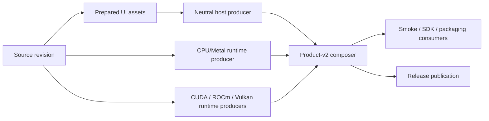

# Depot CI migration and build-graph plan

This document is the migration contract for moving MeshLLM's non-hardware CI
jobs to Depot while restructuring builds around immutable, reusable artifacts.
The implementation must optimize elapsed feedback time without allowing PR,
main, and release products to drift.

## Baseline and targets

Use [`scripts/collect-ci-metrics.py`](../scripts/collect-ci-metrics.py) and the
methodology in [`METRICS.md`](METRICS.md) for every before/after comparison.
The initial mixed-change-class baseline is recorded in
[`metrics/2026-07-29-pr-builds-baseline.json`](metrics/2026-07-29-pr-builds-baseline.json):

| Workflow/cohort | Sample | p50 wall | p95 wall | Maximum |
| --- | ---: | ---: | ---: | ---: |
| PR Builds, successful | 20 | 33m 12s | 55m 33s | 69m 01s |
| PR Builds, successful | 50 | 35m 00s | 82m 42s | 87m 00s |
| Main CI, successful | 50 | 34m 12s | 112m 42s | 125m 54s |
| PR Quality, successful | 30 | 12m 36s | 27m 30s | — |

The 20-run PR cohort's largest job-family p95 values were Windows CUDA
42m 09s, Windows ROCm 39m 23s, Windows CPU 32m 06s, and Swift SDK smoke
27m 12s. Swift finished last in 8 of those 20 runs. A representative full PR
run took 42m 12s; its Windows CPU row took 41m 30s. A representative main run
spent about 77 runner-minutes rebuilding the same Windows neutral host across
backend rows.

These numbers mix change classes. The rollout must compare like-for-like
cohorts and report queue time separately from execution time.

Target service levels:

| Signal | Target |
| --- | --- |
| PR routing/format signal | p95 under 2 minutes |
| Typical Rust PR required signal | p50 under 10 minutes, p95 under 20 minutes |
| Backend-affecting PR | p95 under 30 minutes |
| Main full composed-product graph | p95 under 45 minutes |
| Warm-cache no-op compile request | at least 80% sccache hit rate |
| Artifact consumer rebuilds | zero |

## Product graph

Every supported platform follows one graph:



The shared implementation primitives are:

- `.github/actions/prepare-host-input`: build one backend-neutral host, then
  attest when requested, import-check it, and write a checksum.
- `.github/actions/prepare-windows-host-input`: perform the same immutable host
  preparation for Windows debug/release profiles and include a prebuilt
  attestation verifier for release consumers.
- `.github/actions/prepare-native-runtime-input`: build/package exactly one
  runtime archive and run the release-grade runtime verifier.
- `.github/actions/compose-product-input`: checksum and verify producer inputs,
  compose product-v2 without compiling, and run client readiness.
- `.github/actions/restore-smoke-inputs`: safely extract a composed product,
  revalidate its manifest and bytes, and stage that exact host/runtime pair.
- `.github/actions/capture-sccache-stats`: retain per-job JSON counters for
  offline aggregation with `scripts/summarize-sccache-stats.py`.

`scripts/build-host.sh` is the only Unix host builder.
`scripts/build-release.sh` is a compatibility wrapper. Backend recipes and
workflows must never build a host as a side effect of producing a runtime.

Artifact contracts:

| Layer | Required contents | Mutation rule |
| --- | --- | --- |
| Host input | executable, `.sha256`, `host-imports.json`; release adds attestation | immutable after checksum |
| Runtime input | runtime directory, archive, archive checksum, `manifest.json` | immutable after verification |
| Product input | host, host imports, `product-manifest.json`, one `native-runtimes/<id>` | composer never compiles |
| Static ABI test input | one tarred CPU llama ABI build keyed by patch queue and build recipe | one producer per workflow; test rows only restore |

PR artifacts are unstamped, retained for one day, and cannot be promoted into a
release. Main and release exercise the same actions; release adds version
preparation, signing, public packaging, and publication around them.

## PR, main, and release policy

PRs optimize for the earliest reliable signal:

- route from changed files before compiling consistency checks;
- run formatting directly on a standard runner instead of pulling the large
  backend image;
- build one Linux host and one CPU runtime independently only when an inference
  artifact is needed, then compose them without compiling;
- build backend products only for ABI/backend inputs;
- use the debug profile for the ordinary PR CPU signal and the release profile
  for manual, benchmark, and backend-affecting runs;
- fan that one exact host artifact into the CPU and every selected backend
  runtime row;
- build or restore the static CPU llama ABI once, archive it, and fan those
  exact bytes into every crate-test and grouped-test row instead of compiling
  the same C++ graph concurrently;
- run runner-image contract checks only when their workflow, cache version, or
  cache integration changes;
- make SDK smokes consume the staged product runtime and reject hidden rebuilds;
- keep public-mesh admission out of required PR checks. It remains an explicit
  manual integration probe, while product readiness uses hermetic local mDNS.
- gate fan-in jobs that must tolerate skipped dependencies with
  [`!cancelled()`](https://docs.github.com/en/actions/reference/workflows-and-actions/workflow-cancellation),
  never `always()`, so cancelling a superseded run releases its runner capacity.

Main is the exhaustive trust boundary:

- run all workspace crate-test batches;
- use the same single static-ABI producer/fan-out contract as PR builds;
- build one Linux release host on every non-doc main change;
- build CPU, CUDA, ROCm, and Vulkan runtime products from that host;
- run the longer integration and SDK consumers from uploaded product bytes;
- retain hardware qualification as a separate lane.

Release uses the same host/runtime/product actions. Signing and publishing are
release-only wrappers and never change the underlying compilation process.
The first Depot release phase routes only a `workflow_dispatch` from `main`:
Linux x86 CPU native SDK/runtime producers, compile-only ROCm/Vulkan runtime
producers, and Linux product composers. Tag-triggered releases, metadata,
publishing, attested host producers, inference jobs carrying `HF_TOKEN`,
macOS, Windows, ARM, and hardware-qualified GPU work stay on their existing
runners. The attested host cannot move until unsigned compilation and
GitHub-hosted signing are separate jobs.

## Depot runner rollout

Depot runners are selected with a single label such as
`depot-ubuntu-24.04-8`. MeshLLM uses:

| Workload | Initial label | Reason |
| --- | --- | --- |
| routing, summaries, CLI docs | `depot-ubuntu-24.04` or `-4` | short, low-memory |
| format and UI quality | `depot-ubuntu-24.04-4` | avoid backend image pull |
| Rust check/test/clippy and unsigned host builds | `depot-ubuntu-24.04-8` | CPU-bound compile |
| runtime builds without hardware execution | `depot-ubuntu-24.04-8` | CPU/I/O-bound C++ build |
| measured high-parallelism runtime builds | `depot-ubuntu-24.04-16` | compare wall time, peak disk, and cost before adopting |
| hardware-qualified CUDA tests | dedicated GPU runner | requires a real device |

The current runner selector has one effective repository gate:

- `DEPOT_RUNNERS_ENABLED=true` enables eligible trusted `main` push and
  `main`-ref dispatch jobs. Tag pushes and every other ref remain hosted.
- Every `pull_request` event selects GitHub-hosted runners, even for a
  same-repository branch and even if `DEPOT_PR_RUNNERS_ENABLED` is set.
  `DEPOT_PR_RUNNERS_ENABLED` is ignored while automatic Depot Cache is enabled.

Trusted `workflow_dispatch` runs accept `use_depot=true` for a bounded canary,
but the selector requires `github.ref == 'refs/heads/main'`. The manual input is
never authority to run feature-branch code on Depot. The selector emits one
typed cache permission from the same decision, so a caller cannot select a
hosted runner while independently enabling Depot WebDAV.

This selector is defense in depth, not the primary security boundary. The
current pull-request workflows and repository-local actions are evaluated from
PR-controlled code, so a pull request can modify or bypass the selector itself.
Consequently, repository variables and same-repository comparisons cannot make
the current PR workflow safe for Depot.

Activation prerequisites:

1. The Depot GitHub Apps remain connected to `Mesh-LLM`.
2. While public-repository access is still disabled, change GitHub's
   organization `Default` runner group to selected repository
   `Mesh-LLM/mesh-llm` and selected workflow
   `Mesh-LLM/mesh-llm/.github/workflows/depot-canary.yml@refs/heads/main`.
3. Only after both restrictions are saved, enable public repositories for the
   `Default` group. Depot-managed ephemeral runners register in that group.
4. Dispatch `depot-canary.yml` from `refs/heads/main` twice. Verify all four
   Intel runner sizes, both ARM runner sizes, their reported architectures,
   and a cold-to-warm cache hit without printing credentials.
5. Dispatch the canary from a feature ref, prove that it cannot acquire a
   Depot runner, and cancel that exact queued run.
6. Add exact default-branch workflow refs only as their phase starts. Reusable
   workflows whose jobs run on Depot must be listed separately.
7. Set `DEPOT_RUNNERS_ENABLED=true` only after comparable trusted canaries meet
   the rollout targets.

The initial main allowlist is:

```text
Mesh-LLM/mesh-llm/.github/workflows/ci.yml@refs/heads/main
Mesh-LLM/mesh-llm/.github/workflows/pr_quality.yml@refs/heads/main
Mesh-LLM/mesh-llm/.github/workflows/hf-download-smoke.yml@refs/heads/main
Mesh-LLM/mesh-llm/.github/workflows/smoke.yml@refs/heads/main
Mesh-LLM/mesh-llm/.github/workflows/scripted-binary-smoke.yml@refs/heads/main
Mesh-LLM/mesh-llm/.github/workflows/sdk-smoke.yml@refs/heads/main
```

Add `pr_builds.yml@refs/heads/main` only for its trusted manual benchmark and
`release.yml@refs/heads/main` only for the non-publishing release phase. Never
select a feature ref, `refs/pull/*`, or “all workflows.”

Depot PR execution is intentionally out of the current rollout. Automatic
Depot Cache injects repository-scoped cache authority into the whole job, with
no branch isolation. A default-branch-pinned reusable workflow and separate
cache-key conventions cannot stop malicious checked-out PR code from using
that authority directly. PR code may run on Depot only after automatic cache
injection is disabled and complete token/API isolation is proven, or after
Depot provides a comparably strong per-PR cache boundary. Until then, required
and optional PR-event jobs remain GitHub-hosted; `pr_builds.yml` can be
benchmarked only by a trusted manual dispatch from `main`.

Do not use `pull_request_target` to build or execute PR content. A
default-branch-pinned reusable workflow preserves the normal `pull_request`
event while keeping the runner-owning workflow definition trusted.

As of 2026-07-29, the Depot dashboard reports the `Mesh-LLM` GitHub connection
active with automatic Depot Cache and registry authentication enabled. GitHub's
organization installation API lists `depot-managed-runners` and
`depot-code-access` for all repositories. A read-only organization-settings
inspection found:

- `Default`: all repositories, public repositories disabled, all workflows,
  and no persistent runner;
- `mesh-llm`: two dedicated GPU scale sets, selected repositories including
  public repositories, and all workflows.

The current `Default` state safely prevents Depot from serving this public
repository, so a canary will queue until the ordered restriction changes above
are made. The GPU group is separate from Depot and its all-workflows policy
must also be reviewed before treating those devices as a trusted-only pool.

Depot redirects every GitHub Actions cache API consumer on its runners,
including `actions/cache`, `actions/setup-node`, and third-party cache actions.
Its namespace is repository-scoped and is not isolated by branch. Therefore:

- current pull-request jobs never run on Depot and may use the normal
  `mesh-llm` key namespace in GitHub's native cache because GitHub scopes PR
  writes to the merge ref and trusted main jobs do not restore from that ref;
- a local sccache disk-only setting protects only that sccache child process;
  it does not remove the Depot token or prevent another cache API consumer
  from reading or poisoning the repository cache;
- no untrusted PR code may run on Depot while automatic cache injection is
  enabled;
- trusted main/release jobs may explicitly enable the `disk,webdav` chain and
  fall back to job-local disk.

GitHub-hosted jobs retain the existing disk/GitHub Actions cache path. Never
print a cache token.

Relevant Depot documentation:

- [GitHub Actions runner overview](https://depot.dev/docs/github-actions/overview)
- [Runner quickstart](https://depot.dev/docs/github-actions/quickstart)
- [Runner types and sizes](https://depot.dev/docs/github-actions/runner-types)
- [GitHub Actions cache behavior](https://depot.dev/docs/cache/integrations/github-actions)
- [sccache integration](https://depot.dev/docs/cache/integrations/sccache)
- [Actions analytics](https://depot.dev/docs/github-actions/observability/github-actions-metrics)
- [GitHub runner-group selected-workflow API](https://docs.github.com/en/rest/actions/self-hosted-runner-groups?apiVersion=2022-11-28)
- [GitHub guidance for self-hosted runners in public repositories](https://docs.github.com/en/actions/how-tos/manage-runners/self-hosted-runners/manage-access)

## Cross-repository responsibilities

### `Mesh-LLM/mesh-llm-runner-images`

Runner images own stable tools and backend SDKs, not commit-specific products.
The next image revision should:

1. build the UI once in a Node-capable producer and upload it before any
   Node-free host role starts; `public-rust-host` consumes those prepared UI
   bytes and contains Rust/Cargo/sccache, host libraries, CMake/Ninja, lld, and
   only Cargo dependency warming;
2. publish `public-native-cpu` with the CPU C/C++ toolchain and packaging tools,
   and separate `public-native-{cuda,rocm,vulkan}` roles with only the matching
   GPU SDK. None of these roles owns Rust, Node, pnpm, UI, website, or Python
   application dependencies;
3. publish `public-compose` with only Bash, Python standard library,
   tar/coreutils, required runtime libraries, and artifact verifiers.
   Composition jobs must not carry a backend compiler or SDK;
4. give every role its own verifier that asserts both required capabilities and
   forbidden tools/layers;
5. canary a pinned JavaScript action inside every public role as a job container
   on both GitHub-hosted and trusted Depot runners. This proves the Actions
   Node-external mount contract independently of whether the image ships Node;
6. make one content-addressed architecture base feed every backend overlay,
   and move source-revision provenance after dependency-warm layers;
7. build each architecture/role once, push it under an immutable staging
   digest, run the role verifier and canaries against that exact digest, then
   promote only the verified digest into multi-architecture manifests and
   human-facing tags. Promotion must not invoke another image build;
8. add `self-hosted-*` Actions-runner/device overlays only after all public
   roles pass. Keep the runner agent out of public builder and composition
   images;
9. gate updates on retained compressed-size and controlled cold-pull
   measurements.

The latest measured publication evidence is
[runner-images run 30248081255](https://github.com/Mesh-LLM/mesh-llm-runner-images/actions/runs/30248081255).
It completed 55 jobs in 39m 15s. Its slowest initial `Build and verify test
image` step took 14m 25s, then the later publication pass rebuilt the public
ROCm 7.2 AMD64 image in an 18m 03s `Build and push architecture image by
digest` step. This demonstrates duplicate test/publish image construction; it
does not measure image size, cold-pull time, or cache effectiveness.

No retained audit evidence currently substantiates the previously cited
1.53 GB/1.92 GB compressed sizes or backend cold-initialization medians, so
those values are not migration baselines. The following are provisional design
budgets, not measurements: at most 1.0 GB for `public-rust-host`, 500 MB for a
CPU native builder, 250 MB and 20s cold-pull p50 for `public-compose`, at least
1 GB removed from each backend image, and publication under 25 minutes. Record
per-platform compressed bytes and controlled cold-pull samples before enforcing
or revising any of these gates.

GHCR remains canonical. After the split, a trusted Depot canary may compare a
Depot Registry pull-through reference and the containerd layer store against
the exact same GHCR index/child digests. Adopt either only with at least 20%
and 10 seconds of median pull improvement; never expose the registry or cache
token to PR code.

### `Mesh-LLM/mesh-packaging`

Packaging already consumes product-v2 and must not rebuild the CLI/runtime.
After the MeshLLM graph is stable:

1. replace the global native-package matrix barrier with a reusable per-row
   package → QA → image → QA pipeline;
2. publish a canonical release artifact index from MeshLLM containing source
   SHA, product/host/runtime/addon assets, schemas, and digests;
3. publish Node addon producer artifacts from MeshLLM so packaging assembles
   npm instead of rebuilding five targets;
4. build each runtime image once at an immutable staging digest, test it, then
   promote that digest;
5. route CPU-only packaging rows to Depot after the main repository canary.

The first product-v2 release candidate is the compatibility baseline for that
work; older v0.74 assets predate the contract.

## Measurement and rollout gates

For each phase, save raw observations and label them with provider, runner size,
image digest, and change class:

```bash
python3 scripts/collect-ci-metrics.py \
  --repo Mesh-LLM/mesh-llm \
  --workflow ci.yml \
  --branch main \
  --event push \
  --limit 5 \
  --label provider=depot \
  --label runner=depot-ubuntu-24.04-8 \
  --raw-out /tmp/main-depot-runs.json \
  --json-out /tmp/main-depot-metrics.json \
  --markdown-out /tmp/main-depot-metrics.md
```

Rollout sequence:

1. restrict the `Default` runner group to the repository and only
   `depot-canary.yml@refs/heads/main`, then enable public-repository access;
2. run the allowed-main and denied-feature-ref canaries;
3. compare `-4`, `-8`, and `-16` using Depot CPU/memory/disk utilization data;
4. allowlist main CI plus every directly invoked reusable workflow, then
   canary routing, quality, and the Linux product graph from `main`;
5. collect five comparable green main canaries;
6. set `DEPOT_RUNNERS_ENABLED=true` for trusted main jobs after those canaries
   meet the targets;
7. allowlist `release.yml@refs/heads/main` and exercise the non-publishing,
   non-secret runtime/composition producers. Tag-push publishing remains hosted;
8. keep all PR-event code hosted while automatic Depot Cache is enabled;
9. migrate packaging only after product-v2 and addon contracts are stable.

Rollback for the currently implemented trusted lanes is one
repository-variable change:

```bash
gh variable set DEPOT_RUNNERS_ENABLED --repo Mesh-LLM/mesh-llm --body false
```

`DEPOT_PR_RUNNERS_ENABLED` does not activate Depot in the current PR workflows.
Leave it unset or `false`; any later PR phase requires automatic-cache
isolation plus its own explicit rollback control before activation.

Disabling Depot changes runner placement only. It must not change the build
graph, action inputs, cache keys, or artifact contracts.
