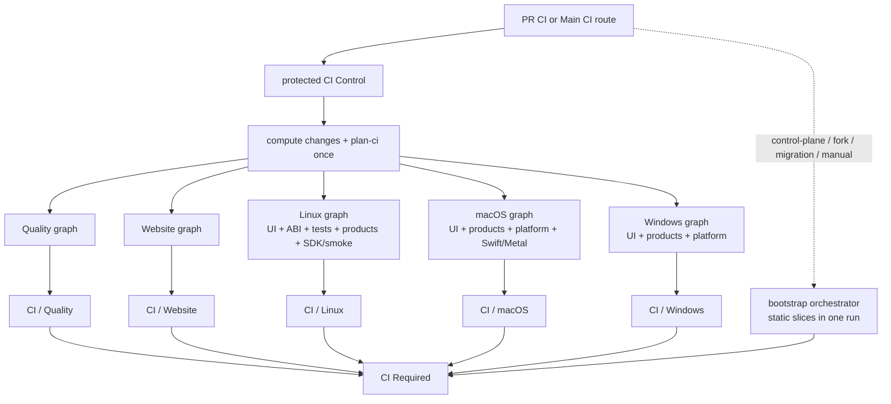

# MeshLLM CI topology

This is the checked-in implementation. Normative rules live in
`.agents/skills/manage-ci/SKILL.md`; the factual inventory is in
`.agents/skills/manage-ci/references/current-inventory.md`; the design record
and acceptance criteria are in `.omo/specs/pr-ci-optimization.md`.

## Entry points

| Workflow | Trigger | Role |
| --- | --- | --- |
| `pr_builds.yml` | `pull_request`, dispatch | Thin PR router; protected control for ordinary same-repository PRs, bootstrap graph for control-plane changes, forks, migration and manual runs |
| `ci.yml` | push to `main`, dispatch | Thin main router; protected control for pushes, bootstrap graph for migration/manual |
| `ci-control.yml` | completed `PR CI` / `Main CI` | Resolves source identity, computes one plan, dispatches lanes, and owns correlated checks |
| `ci-orchestrator.yml` | `workflow_call` | Bootstrap planner and monolithic static slice graph |
| `ci-*-lane.yml` | `workflow_dispatch`, `workflow_call` | Separate Quality, Website, Linux, macOS and Windows graphs |

The lane workflows are not independent planners. Protected control computes
the canonical shape once and passes each lane a digest-bound JSON projection
through native workflow-dispatch inputs. Forks cannot invoke protected
dispatch and therefore use the bootstrap graph. PR runs cancel superseded
synchronizations; main runs are not cancelled.

Protected dispatch is gated on `workflow_run.head_repository.full_name ==
github.repository`. The controller and each lane workflow run from the
protected default branch; the immutable source SHA is passed only to product
checkout steps. Reporting, planning, and orchestration actions therefore stay
protected. Lane workflows retain least-privilege permissions, and pull-request
dispatches receive no repository secrets; a missing or foreign head repository
or control-plane change falls back to the branch-local bootstrap graph.

## Graph shape



Each lane uses a static superset of typed reusable-workflow calls; `if`
conditions consume only its checked planner projection. Protected control uses
the Actions API only for a closed list of five checked-in workflow files and
passes data through native inputs. No workflow YAML is generated and no lane
allocates another planner. Runs have separate graphs/run IDs, correlated by a
controller identity, stable lane checks, source SHA and plan digest. The
bootstrap orchestrator calls the slices directly so a PR caller never has to
grant `checks: write` through a nested reusable-workflow permission chain.

## Planner and profiles

`scripts/plan-ci.py` is the only source of slice eligibility. It reads the
JSON-compatible YAML manifests `ci/ownership.yml` and `ci/slices.yml`, validates
their schema and dependency graph, and emits `ci/ci-plan.schema.json` output.
Each plan contains source/base identities, direct crates, affected crates,
semantic domains, signals, selected slices, reasons, typed matrices, runner
roles, cache modes and fan-out budgets. Unknown paths and malformed inputs fail
closed.

Control-plane changes fail open through the selected profile. When they
require the `web` slice, both console and website rows execute even without a
content-specific change signal, so the stable gate receives a successful
required slice instead of an empty reusable workflow reported as skipped.

Profiles are closed and event-derived:

| Profile | Selection |
| --- | --- |
| `pr-draft` | Quality plus the smallest useful affected signal; core smoke is the only smoke row |
| `pr-ready` | Complete targeted rows for directly owned domains and affected Rust dependents |
| `main` | All workspace, product, platform, backend, smoke and SDK rows |
| `manual-full` | Main-equivalent non-publishing validation on dispatch |

The selected PR row uses the same build commands, profile semantics, artifact
contract and verification as the corresponding main row. Trust-derived
placement, cache mode, artifact namespace and optional credentials may differ,
along with row selection and bounded parallelism.

## Slice catalog

The five lane workflows organize the catalog without changing selected rows:
`ci-quality-lane.yml`, `ci-website-lane.yml`, `ci-linux-lane.yml`,
`ci-macos-lane.yml`, and `ci-windows-lane.yml`. Platform lanes keep each host,
runtime, composition and smoke dependency chain inside one run, so native
runtime producers are not duplicated.

- `ci-quality-slice.yml` — action/packaging/consistency contracts, format,
  bounded Clippy batches and CLI documentation synchronization.
- `ci-web-slice.yml` — console lint/type/test and public website build.
- `ci-ui-artifact-slice.yml` — one immutable console `dist` producer.
- `static-abi-artifact.yml` — one verified portable static llama ABI producer
  that exports the exact toolchain epoch recorded in its artifact.
- `ci-rust-tests-slice.yml` — deterministic affected or all-workspace Cargo
  test batches consuming the static ABI artifact and its producer-owned
  toolchain epoch.
- `ci-host-slice.yml` — one neutral host per selected OS/architecture,
  consuming the immutable UI distribution. Independent Linux, macOS and
  Windows calls prevent an unrelated platform from delaying composition.
- `ci-runtime-product-slice.yml` — invoked per platform first for native
  runtime producers and again for composition-only products. Each platform
  joins only its own immutable host and runtime producers.
- `ci-platform-checks-slice.yml` — macOS portable/unit, Windows portable, and
  focused Windows log-store privacy ACL checks.
- `ci-product-smoke-slice.yml` — CPU core, CUDA, two-node, Metal and model-
  download consumers using only composed artifacts. CUDA inference uses the
  approved `gpu-nvidia` ephemeral self-hosted scale set, including for
  same-repository PRs. That hardware-qualified exception is dispatched only
  from protected default-branch workflows, receives no repository secrets or
  credential-bearing caches, and is restricted to the repository's GPU runner
  group. Its PR runtime is compiled for both sm86 and sm120 because the scale
  set currently contains RTX 3080 and RTX 5090 workers. The smoke installs the
  pinned CUDA 12.9 user-space runtime libraries required by the host-linked
  product before inference.
  ROCm and Vulkan products remain package-verified until eligible inference
  runners are registered.
- `ci-sdk-slice.yml` — platform-local Rust, Kotlin and Swift consumers. Swift
  production starts from the plan and Kotlin production from the shared static
  ABI; only smoke consumers wait for the matching product lane.
- `ci-runner-contract-slice.yml` — plan/provider/PR cache-boundary checks and
  trusted-main runner-image contracts.

Lower-level producers (`native-sdk-artifact.yml`, `swift-sdk-artifact.yml`) and
consumers (`smoke.yml`, `scripted-binary-smoke.yml`, `sdk-smoke.yml`,
`hf-download-smoke.yml`) remain reusable building blocks.

## Fan-out and timing controls

The planner records profile budgets: PR drafts/ready runs allow at most
7 Linux, 2 macOS, 1 Windows matrix workers and 10 planned workers overall;
main/manual runs allow 12, 4, 2 and 18 respectively. Each matrix also sets
`max-parallel`, and backend/platform rows are selected by ownership rather than
by a blanket PR fan-out. Host, ABI and runtime producers remain unique per
selected row. The readability tradeoff is one UI artifact build per active
platform workflow because artifacts are run-scoped; UI tests still execute
only in the Website graph and host producers never rebuild the UI themselves.

Timing evidence is collected read-only with `scripts/collect-ci-metrics.py`.
Do not put run-specific durations or historical conclusions in this document;
record an evidence file separately when a timing experiment is authorized.

## Artifact contract

Every product has three immutable layers:

1. prepared UI assets;
2. a release-profile backend-neutral host per OS/architecture;
3. one native runtime per OS/architecture/backend.

`compose-product-input` verifies checksums, manifests and host import policy,
then composes exact producer bytes without compiling or substituting inputs.
Smoke and SDK consumers download those artifacts and never rebuild a missing
producer. PR and smoke artifacts retain for one day; caches are acceleration,
not correctness contracts.

Release-profile hosts are used for both selected PR rows and main rows. Besides
keeping product semantics identical, this prevents unstripped debug binaries
from being duplicated into every composed product artifact.

## Provider and cache policy

`.github/actions/select-ci-runners` maps semantic roles to approved labels.
Pull requests use GitHub-hosted runners for ordinary work. The sole current
exception is uncredentialed CUDA smoke on the approved ephemeral `gpu-nvidia`
scale set described above; forks use the bootstrap path and receive no
repository secrets. Same-repository dispatched PR caches are restore-only even
though the protected workflow ref is `main`; bootstrap/fork cache writes remain
merge-ref scoped. Neither path may publish trusted-main cache entries. Trusted
`main` Linux roles may use Depot only when
`DEPOT_RUNNERS_ENABLED` is exactly `true`; macOS, Windows, credential-bearing
smokes and other hardware-qualified work retain explicit approved placement.
Provider choice never changes plan membership, commands, artifacts, tests or
summaries.

Depot PR execution is not implemented. Cache isolation, protected
default-branch runner-owning workflow refs, no-secret/no-token execution and a
sentinel canary are prerequisites in `ci/DEPOT_MIGRATION.md`. Do not change
Depot settings or runner groups in a workflow refactor.

## Required extension pattern

1. Read the manage-ci skill, inventory, this file and the optimization spec.
2. Classify the owner: planner, slice, runner/cache policy, producer,
   consumer, release or deployment.
3. Add or extend one typed reusable slice; do not copy a job into an entrypoint.
4. Add ownership and dependency rules to the manifests when routing changes.
5. Preserve immutable producer reachability and add the top-level call to its
   lane summary; update the controller projection if lane membership changes.
6. Keep provider and cache decisions in the central policy action.
7. Run the validation contract and update the inventory/spec status in the
   same change.

Minimum CI-definition validation:

```bash
just ci-validate
```

Use `just ci-shellcheck <changed-script>...` when shell sources change. Planner
fixtures and repository-consistency checks are included in `just ci-validate`;
the narrower `just ci-crate-lists`, `just check-release`, and
`just publish-crates` recipes remain available while iterating. Follow the
complete
[manage-ci validation contract](../.agents/skills/manage-ci/SKILL.md#validation-contract)
for scope-specific checks, and run the canonical `just test-all` target when
full repository validation is required.
