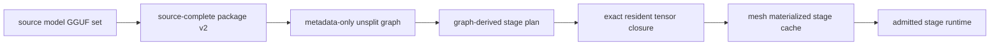

# skippy-model-package

Model inspection and source-complete package-v2 CLI.

This tool uses llama-backed model introspection through the C ABI. GGUF writing
must go through llama.cpp writer code exposed by the ABI; Rust owns package
planning, manifests, checksums, and CLI behavior.

## Architecture Role

`skippy-model-package` prepares the source-complete package consumed by
`skippy-server`. Package creation is independent of stage count and cut
locations. At serving time the native graph planner derives each stage's exact
resident tensor closure from the normal unsplit graph:



Mesh treats these generated shards as derived cache. Package-backed models use
stable Hugging Face identity from `model-ref`/`model-hf`; direct local GGUFs are
materialized as synthetic package inputs instead of using the path stem as a
model id.

## Commands

```bash
skippy-model-package inspect model.gguf
skippy-model-package write-package org/repo:Q4_K_M --out-dir model-package/
skippy-model-package write-package org/repo:Q4_K_M --projector mmproj-model-f16.gguf --out-dir model-package/
skippy-model-package verify-package-v2 model-package/ --source model.gguf
skippy-model-package validate-glm-dsa-contract model-package/
```

`write-package` prefers model coordinates such as `org/repo:Q4_K_M`. It resolves
the coordinate through `model-ref`, `model-artifact`, and the `huggingface-hub`
backed `model-hf` adapter, downloads the resolved source artifact, and records
the resolved repo, revision, primary file, canonical ref, distribution id, and
artifact file set in `model-package.json`.

### Package v2 writer

`write-package` emits the shared `skippy-package-format` schema v2. It captures
all source GGUF directories and native stored sizes before writing. The native
role classifier assigns every tensor exactly once to a shared common group or a
layer group. The writer emits `shared/common.gguf` and
`layers/layer-NNNNN.gguf`, subdividing an oversized group into stable
`*-partNN.gguf` artifacts. It then emits the metadata-only carrier
`shared/metadata.gguf`, whose descriptors and payload locators cover the
verified artifact catalog.

The writer reopens every payload and compares exact names, types, dimensions,
stored lengths, alignment, and file SHA-256 against the independent inventory.
Padding is not counted as tensor storage. Shard counts and total tensors are
checked against GGUF split metadata; duplicate source names, missing source
files, unbound tensors, and unexpected tensor copies fail closed. Physical
grouping does not assign stage ownership: runtime admission derives each
executable slice and exact tensor closure from the native graph plan.

The catalog supports explicit storage aliases. The pinned native GGUF inspector
currently rejects shared-offset tensor directories, so such sources are rejected
rather than silently expanded or certified. Ingesting those sources requires a
separate native inspection change. Equal bytes in distinct source allocations
are **not** aliases.

Pass `--projector path/to/mmproj*.gguf` to copy and verify explicit projector
sidecars. This writer does not infer generation policy/defaults from tensor names
or implement offline conversion. The retired schema-v1 planning, slicing,
validation, and preflight commands are not available. Runtime admission derives
the executable slice and exact tensor closure from the native graph plan.

### Standalone v2 verification

```bash
skippy-model-package verify-package-v2 ./model-package \
  --source ./original/model.gguf

# If the original logical primary filename differs from its local filename:
skippy-model-package verify-package-v2 ./model-package \
  --source ./download.gguf --source-file subdir/model.gguf \
  --source-projector ./original/mmproj.gguf
```

This read-only command requires independent local source files outside the package
and resolves the complete GGUF shard set from `--source`. `--source-file` supplies
only its logical identity; expected tensors and hashes always come from the source
files, never the manifest. Every declared projector requires an independent
`--source-projector` (repeatable; matched by content, not argument order). It does
not download missing originals or fall back to package files as source evidence.
Symlink escapes and source/artifact hard-link identity are rejected.

Verification checks v2 schema and package identity, every artifact size/SHA-256,
source-file completeness, model metadata, and exact catalog identity, dtype,
dimensions, offsets, native stored lengths, alignment and integrity. It reopens
artifacts and compares them with the frozen independent directories. Missing or
substituted tensors, inconsistent source identities, duplicate artifacts/sidecars,
unproven alias claims, v1 manifests and corrupt/truncated files fail with nonzero
exit status. Success prints JSON with the package ID, `source_completeness_verified`
and checked source/artifact/tensor/projector counts; it does not modify the package.

This unit verifies the writer's **byte-preserving whole-shard representation**.
Repacked/transformed containers, tensor-only digests, non-projector sidecars and
shared-offset aliases are not supported. Uploaded artifacts must be restored
locally before verification. Caller-supplied source provenance remains a trust
boundary: matching bytes do not authenticate a repository/revision label or prove
that a caller-provided source is the intended model. Success is not metadata-graph,
runtime-admission or inference certification.

Local paths are only accepted for package creation when the caller supplies
explicit provenance:

```bash
skippy-model-package write-package ./model.gguf \
  --out-dir model-package/ \
  --model-id org/repo:Q4_K_M \
  --source-revision abc123 \
  --source-file Qwen3-8B-Q4_K_M.gguf
```

This keeps canonical package identity tied to real model coordinates rather
than inferred from arbitrary filesystem paths.

V2 creation rejects `--transform-artifact-command`: perform conversion or
quantization on the independent source before packaging. It must not redefine the
expected inventory from transformed or incomplete output.
`--after-artifact-command` runs only after an artifact passes exact source checks;
as before, an upload hook may delete that verified local copy. If it leaves a copy,
that copy is checked again. Remote upload verification remains the hook's duty.
`--resume-existing-artifacts` verifies existing copies against the original source
before reuse; source files remain mandatory. An existing `model-package.json` is
never overwritten; use a new output directory. The manifest completion marker is
written only after all artifact checks succeed.

`validate-glm-dsa-contract` is the local pre-spend gate for GLM-5.2-style
artifacts. It checks GGUF metadata, tensor completeness, native MTP
preservation, and Full/Shared IndexShare roles. New GLM-DSA artifacts must
expose roles through `glm-dsa.attention.indexer.types` or frequency/offset
metadata; tensor-presence inference is reported as a compatibility fallback
and fails the contract gate.
