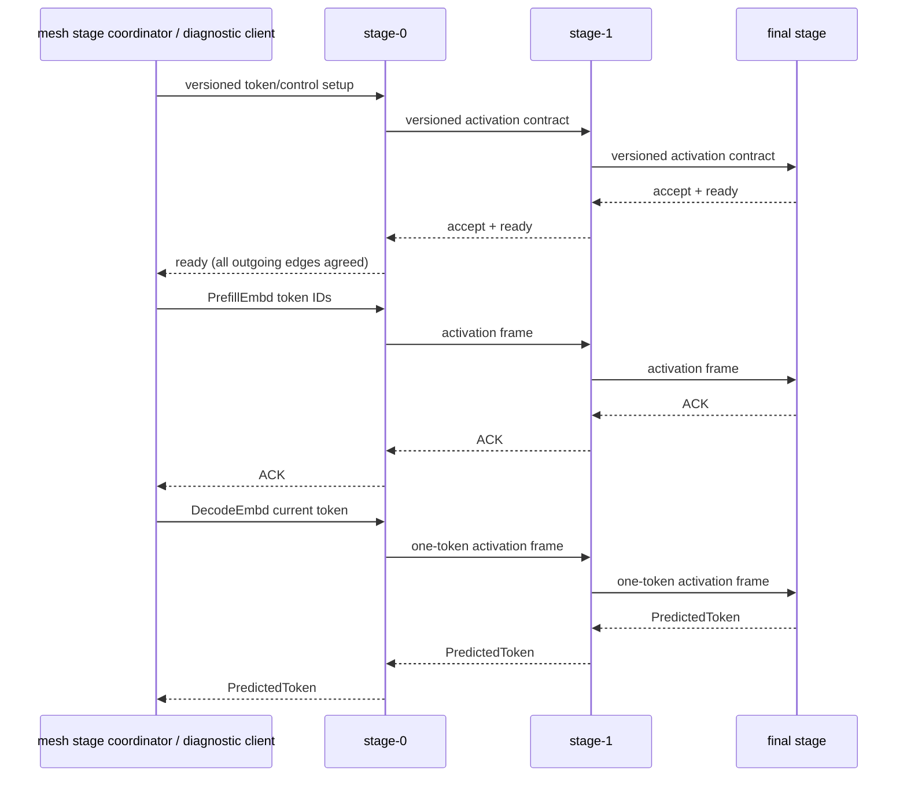

# skippy-protocol

Versioned protocol types for staged execution.

This crate owns wire-compatible message, reply, activation, and state-header
encoding. It should remain independent of server process lifecycle and llama ABI
bindings.

## Architecture Role

`skippy-protocol` is the binary contract for Skippy stage control, artifact
transfer, and activation transport. Mesh owns admission, subprotocol discovery,
connectivity, and stream muxing; Skippy owns the protobuf schema and semantics.
Control and artifact frames are carried through the mesh `STREAM_SUBPROTOCOL`
envelope, while activation transport remains on `skippy-stage/2` between
neighboring stage servers.



Protocol generation 12 agrees activation profiles during connection setup.
Each profile binds the realized frontier, part identities/types, token axis,
fixed dimensions, bounded non-token dynamic dimensions and optional-part
vocabulary. Both peers explicitly accept count-limit intersections. A middle
stage completes its outgoing agreement before confirming upstream readiness.
Prediction-return connections identify their role using the same mandatory
version framing and carry no activation table.

Generation activation frames carry the connection generation, profile ID,
actual token/sequence counts, optional-part presence, bounded dynamic values,
and payload. Receivers reconstruct full dense native descriptors locally and
validate bounds and payload length before execution. F32 parts use the selected
codec; other typed parts remain byte-exact. Full descriptors are still used for
internal messages, but are not accepted as an alternative wire encoding.

Agreements are immutable and shared by established stream clones. Callers must
serialize whole-frame writes and retain one logical reader. Reconnection uses
a fresh generation; reconfiguration closes/drains the previous connection.
Unknown profiles, stale generations and incompatible versions fail closed.
There is no generation-time schema renegotiation or legacy READY fallback.

Wire agreement preserves the scheduler's batching policy. Native executable
reuse remains independently guarded by batch, KV and sampler state; a miss may
build locally without changing the connection agreement. Configured wire limits
are upper bounds, not a promise that every KV/sampler execution is admissible.

The generation also requires mesh-subprotocol control, list-valued status
responses, strict local-content identity, canonical stage-admission descriptors,
and stale verify-window discard. Participants validate the descriptor while
loading and echo it when ready; package, plan, range, tensor, sidecar, profile,
backend or graph-configuration mismatches reject the stage.

## Responsibilities

- binary stage message and reply codecs
- multipart typed activation framing and codec policy
- versioned role setup and immutable activation agreements
- stage config fields that must survive JSON generation, including K/V cache
  type strings consumed by the runtime layer
- protocol compatibility constants

Because skippy is new inside mesh, this protocol can evolve independently from
the stable mixed-version mesh protocol. Keep changes explicit and versioned so
stage nodes fail closed instead of corrupting an active topology.

Run protocol tests with:

```bash
cargo test -p skippy-protocol
```
