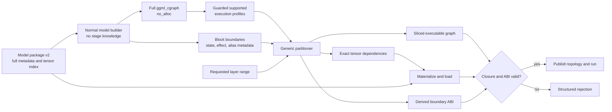

# Generic Skippy Graph-Derived Stage Splitting Plan

Status: complete. Graph Filter V2 is the only production stage-filter path.

## Completion Record

The cutover is complete with these final scope decisions:

- All supported graph-filter rows use graph-derived planning. The retired
  stage-filter implementation, compatibility selectors, and family-owned core
  filtering branches were deleted rather than retained as fallbacks.
- Durable llama.cpp changes are applied in this order: top-level core patches,
  `patches/model_support/` family patches, then generated graph-semantics
  patches. New-family support remains isolated in `model_support/`.
- Existing product smokes own acceptance. Core CPU, CUDA, and Metal restore the
  checksum-pinned SmolLM2 Q8 dense and Granite H Q4 recurrent fixtures, then run
  both through standalone inference, OpenAI client compatibility, and the
  constrained-stack restart. The CPU two-node split smoke runs the same pair,
  requires exact `kv-recurrent` telemetry for Granite, and uploads reconciled
  topology and cache evidence.
- There is no separate product-integration workflow, Qwen migration gate, or
  EveryCut product-smoke lane. Adding EveryCut to normal CI was rejected because
  it would multiply runtime without adding a distinct product contract. Legal
  cut and family breadth remain the responsibility of the existing focused
  certification tests and llama canary rather than a second smoke
  orchestration path.
- Existing v2 packages are accepted after strict package verification; a
  blanket corpus rebuild is not a completion requirement. Packages are rebuilt
  only when their source, format, graph semantics, or verification result
  requires it.

The workstream, ownership, and delivery sections below preserve the design
history that led to the cutover. Where an earlier proposal conflicts with this
completion record, the completion record and the current CI documentation in
`ci/ci.md` are authoritative; unchecked historical checklist items are not
remaining Graph Filter V2 work.

## Implemented Decision

Skippy's three independent descriptions of a stage are replaced with one
graph-derived stage plan:

1. Build the normal unsplit `ggml_cgraph` in metadata-only mode.
2. Partition it using generic, stage-independent block and state metadata.
3. Derive the executable node set, exact tensor dependency closure, activation
   boundary, and state ownership from that partition.
4. Load only the derived tensor set from a new model-package format.
5. Validate the realized stage before topology publication.

No model family names, architecture enums, tensor-name heuristics, or mutable
filtering diagnostics may participate in stage selection.

## Problem Statement

Before this cutover, the same `[layer_start, layer_end)` request was interpreted
independently by three systems:

- package planning chooses artifacts using layer, role, endpoint, and name
  heuristics;
- native loading filters tensors using coarse ownership classes and family
  exceptions;
- model builders contain copied stage-range, activation-input, output, and
  early-return branches.

Correctness depends on all three interpretations agreeing. Granite exposed one
generic failure mode: mutable loader state suppressed separate Q/K/V weights
while the graph still referenced them. Other families can diverge through
shared weights, experts, recurrent state, sidebands, hyper-connections, tied
outputs, or optional execution paths.

## Proposed Design Invariants

These invariants are non-negotiable implementation gates:

1. **One computation graph.** Reuse the actual `ggml_cgraph`; do not create a
   parallel model IR that can drift from execution.
2. **No stage-aware model builders.** Builders construct their normal unsplit
   computation. They never receive a stage range and never choose stage input,
   output, or weight ownership.
3. **Stage-independent annotations only.** Builders or common graph helpers may
   register block input/output, layer ordinal, aliases, and persistent-state
   effects because those are properties of the unsplit computation.
4. **No model-aware splitter.** The partitioner cannot inspect family names,
   architecture enums, tensor names, fused/separate projection types, or
   model-specific flags.
5. **Exact dependency closure.** Every parameter referenced by a retained op is
   loaded exactly once with matching identity, dtype, and shape.
6. **Effects are dependencies.** KV/recurrent reads and writes, aliases,
   ordering constraints, and lifetimes participate in the slice closure.
7. **Boundaries preserve frontier liveness.** Activation and state planes are
   derived from values live across each selected block frontier, not declared
   by family policy. A value that skips an intermediate stage remains a typed
   pass-through import and export even when that stage does not consume it.
8. **Persistent state stays local.** KV or recurrent state remains owned by the
   stage executing the relevant layers unless a real graph edge crosses the
   cut.
9. **Execution profiles remain guarded.** Prefill, decode, batch, speculative,
   and optional paths retain separate executable slices and boundary schemas.
   Only their resident weight requirements are conservatively unioned. A
   single traced shape or one merged executable graph cannot certify a stage.
10. **Legal cuts are derived.** A numbered layer boundary is not automatically
    legal. Unsupported boundaries fail closed with a structured reason.
11. **Validation precedes publication.** No partial or inconsistent stage is
    advertised to the topology.
12. **Deterministic planning.** The same package identity, graph/planner
    semantic version, graph-affecting configuration, runtime profile, and
    requested range produce the same normalized plan and digest independent of
    tensor-probe order.

## Target Data Flow



## Workstream 0: Baseline and Ownership

- Treat Astrid's immediate QKV correction as a separate correctness fix; do not
  duplicate or block it in this structural project.
- Carry forward the final reviewed result of
  [PR #1662](https://github.com/Mesh-LLM/mesh-llm/pull/1662), including the
  consolidated dense/recurrent smoke and repeated-prompt coverage merged from
  [PR #1665](https://github.com/Mesh-LLM/mesh-llm/pull/1665). Do not fork or
  reimplement that recurrent-KV work in this project.
- Start the structural work from the integration commit containing the current
  staged-runtime behavior, the recurrent-KV work, and the immediate correctness
  fix.
- Record exact baseline commits for Mesh and the prepared llama.cpp tree.
- Capture current package corpus identities, supported-family registry, stage
  protocol generation, and end-to-end parity results.
- Freeze an expected support matrix before enabling the new planner. It records
  every certified model profile, required lane, currently supported cut, and
  capability obligation independently of what the new partitioner later
  chooses to accept or reject.
- Record the recurrent/split live result as required but not accepted until the
  null-weight graph-filter failure is fixed and the dense plus recurrent
  composed-product cases pass.
- Use a dedicated worktree. Do not modify the default branch.

**Exit gate:** reproducible baseline, independently frozen expected support
matrix, and no ambiguous ownership with the Granite fix or activation-plane
work.

## Workstream 1: Package Format v2

Create a new package format and make it the only accepted format for the new
runtime path. Do not add long-lived v1 runtime compatibility.

### Manifest contents

- package schema version and immutable package identity;
- source model identity and complete model hyperparameter metadata required for
  `no_alloc` graph construction;
- artifact table: stable artifact id, path/reference, byte size, and SHA-256;
- tensor table with one entry per source tensor:
  - stable tensor identity/name;
  - dtype and complete dimensions;
  - optional stage-independent layer ordinal used for physical organization and
    diagnostics, never for dependency correctness;
  - artifact id, data offset, stored length, alignment, and tensor checksum or
    artifact-bound integrity proof;
- tokenizer, projector, and generation-sidecar identities where applicable;
- Skippy native ABI requirements and package-generator version.

### Physical layout

- Per-layer GGUF artifacts may remain because they are efficient physical
  containers.
- Replace semantic `embeddings` and `output` ownership assumptions with generic
  shared artifacts. Physical grouping cannot decide stage ownership.
- Every source tensor appears exactly once in the catalog unless an explicit
  alias record proves shared storage.
- Package creation is independent of stage count and cut locations.

### Creation and validation

- Generate artifacts and the catalog from the same source inventory.
- Re-open written artifacts and compare exact tensor identity, dtype, shape,
  offsets, and integrity—not only tensor count and aggregate bytes.
- Build the metadata-only unsplit graph from the package catalog as a package
  certification step.
- Reject missing, duplicate, mismatched, overlapping, or out-of-bounds tensor
  records.
- Provide an optional offline v1-to-v2 converter. Existing v1 artifacts prove
  only what survived old package selection, not what the source model
  contained. The converter may certify full coverage only by comparing against
  the original source tensor directories or an immutable, source-bound tensor
  inventory captured independently of v1 selection. Without that independent
  expected set it must refuse certification and require a rebuild.

**Exit gate:** v2 packages can reconstruct the full metadata model without
reading weight payloads, and the current certification corpus has been rebuilt
or converted only where independent source evidence proves full coverage.

## Workstream 2: Metadata-Only Unsplit Graph

- Prototype the existing llama.cpp `no_alloc` path against representative
  models. Prove that it creates all required tensor handles without reading or
  allocating weight payloads.
- Build the exact normal graph used for execution rather than a second model
  description.
- Remove the stage filter from planning builds; every model builder emits its
  unsplit computation.
- Replace all seven current graph-build thread-local inputs with explicit,
  session-scoped build inputs: the stage filter, activation tokens, RWKV7
  `v_first`, Gemma3n AltUp, Qwen4Exp HC, GLM-DSA top-k, and MTP embeddings.
  Removing only `g_skippy_graph_filter` does not eliminate call-order
  dependence.
- Unify set/clear ownership under one scoped lifetime. The current mix of
  unconditional session-end clearing and an RAII filter scope must not permit
  one interleaved session to clear or inherit another session's graph inputs.
- Keep graph-affecting activation policy such as GLM-DSA policy explicit and
  digest-bound; explicit input does not imply that it belongs in the derived
  tensor closure.
- Add a planning profile matrix covering at minimum:
  - prompt prefill;
  - single-token decode;
  - multi-sequence/batched execution;
  - enabled speculative/MTP paths;
  - enabled multimodal or other optional paths that affect the language graph.
- Normalize each admitted execution profile separately. Preserve its own
  executable slice, guards, and boundary schema; union only exact parameter
  requirements needed for the shared resident weight set.
- Bind admitted profiles to graph/planner semantics and all graph-affecting
  configuration. Every subsequently built runtime graph must match an admitted
  contract before execution; a new configuration either replans or rejects.
- Reject unstable or unexplained shape-dependent tensor closures.
- Measure planning time and metadata memory. Assert that no full-model weight
  allocation or KV allocation occurs merely to plan.

**Exit gate:** the same executable graph machinery builds in metadata-only mode,
produces a real slice, binds only selected weights, and completes prompt prefill
plus multiple decode steps for dense and stateful fixtures, with bounded
planning resources and no unselected weight payload reads.

## Workstream 3: Generic Graph Semantics

Extend the executable graph with only the semantics required for a correct
partition. Do not encode staging policy.

### Block structure

- Register a canonical input and output boundary for every transformer or
  recurrent block with its layer ordinal.
- Prefer common builder/context helpers such as `begin_block` / `end_block`.
  Model-file edits may be mechanical registration only.
- Add a validation/lint gate: every declared layer has exactly one ordered block
  entry and exit for each supported graph profile.
- Do not infer block boundaries from node names.

### Parameters and aliases

- Classify every graph leaf explicitly as a catalog parameter, request input,
  persistent state, or activation import. Do not infer a leaf class from where
  its tensor was created.
- Identify parameter leaves by stable catalog identity.
- Preserve view/base relationships and storage aliases.
- Ensure an alias cannot make an unloaded base allocation reachable.
- Define request-input bindings for token ids, positions, masks, and equivalent
  invocation data so they cannot be mistaken for activation planes or weights.

### Effects and persistent state

- Represent KV/recurrent state reads, writes, and ordering dependencies in the
  graph or in a side table owned by that exact `ggml_cgraph`.
- Bind the memory/KV layer filter to the same normalized `StageSlicePlan` used
  for graph nodes and parameter loading. It must not remain an independent
  fifth interpretation of `layer_start` / `layer_end`.
- Attach each persistent state component to its stage-independent layer owner.
- Distinguish persistent local state from values that genuinely cross a stage
  boundary.
- Reject any family whose necessary state remains invisible to the planner.

**Exit gate:** generic metadata fully describes block frontiers, parameters,
aliases, and effects for the fixture set. No family-specific splitter code is
introduced.

## Workstream 4: Pure Graph Partitioner

Implement the partitioner as a deterministic pure function of:

```text
(normalized graph profiles, package tensor catalog, requested range,
 runtime capabilities) -> StageSlicePlan | UnsupportedStage
```

### Algorithm

1. Resolve the requested start and end to registered block frontiers.
2. Classify every graph leaf as parameter, request input, persistent state, or
   activation value before computing a boundary.
3. Compute graph-wide value liveness at every registered frontier for each
   admitted execution profile.
4. Retain computation from the start frontier through the end frontier.
5. Preserve all effect nodes, ordering edges, alias bases, and lifetimes needed
   by the retained computation.
6. Import every activation value live at the start frontier. Export every
   activation value live at the end frontier, including an imported value that
   the stage merely forwards to a later consumer. Preserve semantic identity
   across pass-through planes.
7. Resolve parameters locally from the catalog, request inputs from the
   invocation contract, and persistent state from its declared owner; none may
   be reclassified as an upstream activation.
8. Walk the retained graph to derive exact parameter identities.
9. Preserve separate guarded executable slices and boundary schemas per
   profile, then union only their exact parameter identities into the resident
   weight requirement.
10. Classify persistent state ownership from registered state effects.
11. Validate that every dependency resolves exactly once in the package
    catalog.
12. Normalize and hash the plan.

### `StageSlicePlan`

- descriptor version;
- requested and realized layer range;
- legal-cut result and structured rejection reason;
- guarded per-profile executable-slice identifiers and boundary schemas;
- exact sorted tensor dependency identities and digest;
- logical parameter bytes derived from the catalog, separate from
  backend-specific allocated, aligned, repacked, and peak bytes;
- request-input bindings and typed activation pass-through relationships;
- typed input and output boundary planes;
- persistent KV/recurrent state ownership and geometry;
- supported execution profiles, sequence/batch limits, and backend constraints;
- plan digest bound to package identity, graph/planner semantic version, native
  ABI, and graph-affecting configuration.

The partitioner cannot call or depend on model-family helpers.

**Exit gate:** unit/property tests prove closure, deterministic output, complete
frontier liveness including pass-through values, guarded profile separation,
and effect preservation for valid and invalid cuts.

## Workstream 5: Exact Realization and Loading

- Resolve `StageSlicePlan.tensor_dependencies` through the v2 tensor catalog.
- Initially materialize a stage-local GGUF if that minimizes changes to the
  existing loader; direct callback/range loading can follow without changing
  the plan contract.
- During real graph construction, create metadata tensor handles for the full
  model but allocate/read payloads only for the dependency closure.
- Instantiate the executable slice from the same normalized plan used for
  loading.
- Before executing any concrete graph, verify that its profile, guards,
  boundary schema, parameter references, effects, and configuration match the
  admitted plan. Replan or reject on mismatch.
- Make representation selection structural: the unsplit graph references fused
  QKV or separate Q/K/V according to what exists; the loader never makes that
  choice.
- Return the realized descriptor through the native ABI.
- Before topology publication, verify:
  - every retained op operand is resolved;
  - every loaded tensor is in the closure;
  - no closure tensor is absent;
  - dtype, shape, alias, and backend placement match;
  - catalog-derived logical parameter bytes match the dependency closure while
    physical and peak backend allocations are reported separately;
  - input/output plane descriptors match neighboring stages;
  - state ownership and supported operations are complete.
- Fail with a structured `UnsupportedStage` / `InvalidPackage` error, never an
  assertion or null operand during graph execution.

**Exit gate:** load-time tensor identity exactly equals planned closure and all
negative fixtures fail before topology publication.

## Workstream 6: Protocol and ABI

### Native ABI

- Add a metadata-only `skippy_stage_planner` handle that owns the whole-model
  planning model, effective graph configuration, and exact package
  `Tensor.id` bindings. Existing serving model/session handles are too late in
  the admission lifecycle and may already be filtered.
- Add an immutable, pointer-free `skippy_stage_plan` descriptor carrying the
  normalized `StageSlicePlan` fields needed by the host. Returned descriptor
  strings are plan-owned and remain valid until the plan is freed.
- Bind the plan digest one-way to the package identity: package catalog to
  `package_id`, then realized native stage descriptor to `plan_id`. Paths,
  native tensor names, process pointers, and enumeration order are excluded.
- The stage-plan surface entered at native ABI `0.1.51`; exact admitted tensor
  closure binding advances it to `0.1.52`. Feature bit 17 remains reserved for
  stage planning after the explicit build-input, package-binding, and renamed
  multi-shard metadata proofs pass.
- Prefer additive ABI entry points during development; remove obsolete
  stage-filter APIs only at final cutover.

### Network protocol

- Do not block the internal graph design on a wire change.
- At the atomic v2-only cutover, advance the stage control protocol to
  generation 11 and require a versioned stage-plan admission descriptor carrying
  `package_id`, the content-derived native `plan_id`, the exact stage range, strictly
  sorted resident tensor ids, typed sidecars, and all guarded profile/slice
  identities. Generation-7 nodes may remain visible to mesh discovery but
  cannot join, coordinate, source artifacts for, or receive a generation-11
  topology. There is no downgrade or v1/direct-GGUF fallback.
- Carry graph-described activation frontiers in the generation-11 multipart
  frame. Each part includes:
  - repeated plane descriptors with stable semantic ids;
  - dtype, layout, dimensions/strides, byte offset, and byte length;
  - bounded payload framing and integrity validation;
  - exact producer/consumer descriptor matching.
- Select the configured codec, or a lossless codec under the lossless policy,
  while forwarding. Raw F32 remains a supported codec and fallback. Receivers
  decode under the same policy and validate the complete typed descriptor.
- Preserve discovery-level mixed-version visibility, but reject
  mixed-generation split topologies through capability negotiation at the
  coordinated v2-only cutoff. Package v1 compatibility is intentionally not
  retained.
**Exit gate:** graph-described multipart activation framing runs behind
generation-11 control admission; every participant echoes and verifies the same
package/plan/stage descriptor, typed frontier obligations in the frozen support
matrix are validated before execution, and unsupported boundaries reject before
topology publication.

## Workstream 7: Migration and Deletion

Use shadow comparison and qualification before release, followed by one atomic
production cutover. There is no phased production or model-family cutover and
no release in which v1 and v2 serving paths coexist.

1. Add the new planner behind a development-only switch.
2. In shadow mode, build the current stage and independently compute the new
   plan. Compare exact tensor identities, realized boundaries, state ownership,
   and logical bytes without changing execution. Treat this comparison as a
   migration diagnostic; unsplit numerical execution remains the correctness
   oracle, and old over-retention or bugs are not compatibility requirements.
3. Exercise execution from the new plan only in development and qualification
   environments, starting with compact dense fixtures and expanding to
   fused-QKV, separate-QKV, MoE/shared-weight, hybrid/recurrent,
   hyper-connected, sideband, MTP, and multimodal fixtures.
4. Rebuild or independently certify and convert the complete production package
   corpus offline to v2. The v1 converter is migration tooling only; it is never
   linked or invoked as a serving fallback or runtime compatibility mode.
5. Run focused family certification, composed-product, recurrent-KV, and staged
   CPU/CUDA/Metal qualification against verified v2 packages.
6. Land typed boundary transport before cutover and certify every frozen
   baseline obligation against the graph-described multipart framing.
7. Ship one atomic release that accepts only package v2 and executes only the
   graph-derived plan.
8. In that same cutover, delete:
   - thread-local and mutable stage-filter diagnostics;
   - loader family retention branches;
   - package role/name stage-selection policy;
   - stage-range branches and stage-boundary early returns from model builders;
   - development shadow mode, v1 package acceptance, and every runtime selector
     for the old path.
9. Recreate the durable llama.cpp patch queue from the pinned upstream before
   cutover. Fold transitional corrections into their capability-owning patches,
   remove obsolete filter and diagnostic patches, preserve unique contiguous
   numbering, and prove a fresh replay. Do not append a terminal cleanup patch
   that leaves the obsolete implementation in earlier queue history. Apply the
   recreated queue as top-level core patches, `model_support/` family patches,
   then generated graph-semantics patches.

Rollback is an explicit deployment rollback to the previous binary and v1
package corpus. It is not a runtime toggle, mixed-fleet compatibility promise,
or reason to ship both serving implementations in one release.

**Exit gate:** searches over the splitter, loader, package planner, and model
builders find no model-family staging policy and no stage-filter control flow.

## Workstream 8: Verification Matrix

### Pure partitioner tests

- first, middle, final, single-layer, and invalid cuts;
- parameter-free ops at boundaries;
- residual, skip, fan-out, and alias edges;
- a three-stage skip or sideband edge whose value passes through a middle stage
  without being consumed there; every two-stage cut alone is insufficient;
- effect-only KV/recurrent writes;
- deterministic output under tensor and node enumeration changes;
- separate guarded prefill/decode/batch/optional slices with a shared
  conservative parameter union;
- unsupported hidden state and unrepresentable boundary failures.

### Package tests

- exact full-source tensor coverage;
- missing, duplicate, mismatched dtype/shape, corrupt offset, alias, and checksum
  failures;
- v1 rejection with an actionable conversion command;
- v1-to-v2 conversion success only when an independent source inventory proves
  the package complete;
- refusal when only the selected v1 artifacts are available as the expected
  tensor set;
- no weight payload reads during metadata planning.

### Native/runtime integration fixtures

- dense separate-QKV model, including Granite or Granite-Hybrid;
- fused-QKV model;
- MoE and shared-expert model;
- recurrent and hybrid model with persistent state;
- sideband/hyper-connected model;
- MTP/speculative path;
- multimodal language path where it changes graph dependencies.

For every legal cut:

- package load succeeds;
- one prompt prefill succeeds;
- multiple decode steps succeed;
- split and unsplit logits/selected tokens satisfy the existing correctness
  tolerance;
- neighboring boundary descriptors match exactly;
- planned dependency identities equal loaded identities;
- logical parameter bytes equal the catalog sum while backend physical and peak
  allocation measurements are reported independently;
- state export/import and prefix-cache behavior remain correct where supported;
- three-or-more-stage composition preserves live pass-through values and state
  lifecycle across adjacent boundaries.

Run the same behavioral matrix through direct GGUF, callback/SafeTensors, and
model-package v2 sources where those paths are supported.

### Cross-cutting product acceptance and KV validation

Lane D owns one product-level correctness contract for changes to cache,
split-serving, llama.cpp or the native runtime ABI, package/model loading, and
the certification harness. It complements graph-level certification by proving
the composed product, real mesh topology, and OpenAI traffic together.

#### Final suite topology

- Define one registry-backed, checksum-pinned standard product manifest for all
  supported platforms. It contains exactly these two immutable fixtures:

  | Role | Required fixture |
  | --- | --- |
  | Dense | SmolLM2-135M Q8 |
  | Hybrid/recurrent | IBM Granite 4.0 H 350M Q4 |

  CPU, CUDA, and Metal resolve the same model/package/tokenizer identities from
  that manifest. Workflow-local URLs, mutable revisions, and divergent
  per-platform model lists are forbidden.
- Keep the existing core smoke rather than adding a second product-integration
  workflow. Restore the composed product and both fixtures once, then run dense
  and recurrent standalone inference, OpenAI client compatibility, and
  constrained-Tokio restart as separately named steps.
- Keep the existing two-node split smoke as the cache/topology owner. It starts
  a dense seed/worker pair, tears it down, then starts a Granite seed/worker
  pair. The two legs never form a mixed dense/recurrent topology.
- A split failure fails the job and uploads model-labelled logs, strict identity
  snapshots, and reconciled evidence on success or failure. Dense and recurrent
  outcomes cannot mask one another.
- CPU remains the normal product row. The same reusable core workflow runs on
  CUDA and Metal with explicit device selection, validates the composed-product
  backend, and forces discovery through the native runtime bundled beside the
  host. CUDA additionally verifies its packaged dependency closure and device
  probe with `LD_LIBRARY_PATH` unset.
- Preserve genuinely independent signals, including the upstream llama canary
  and separately justified backend-specific CUDA qualification. Consolidation
  must not collapse distinct compatibility or hardware evidence into the
  product suite.
- Keep deeper family and competitive evidence outside the standard two-model
  product-download suite: Falcon-H1 and Granite-1B competitive fixtures remain
  scheduled/manual coverage, and the Mamba family battery remains a diversity
  signal. The suite consolidation does not delete or replace those lanes.

#### Semantic cache correctness

For both dense and recurrent family rows, require:

- deterministic split/unsplit output or token equivalence;
- cold recomputation equivalence with the permitted restored continuation;
- explicit expected-hit evidence and internally consistent cache accounting;
- failure on fatal native cache, state, allocation, or graph logs;
- repeated-equal and growing-prefix traffic in one fixture:
  `X, X, X+E1, X+E1, X+E1+E2, X+E1+E2`;
- a deliberately incompatible cache identity that must miss, recompute safely,
  and reproduce the reference continuation;
- a bounded deterministic overlap/pressure case that checks independent request
  tails, cache accounting, and ownership/eviction safety.

A cache hit metric is evidence, not correctness by itself. A fast or plausible
continuation that differs from the cold/unsplit oracle fails.

#### Atomic recurrent-state rule

- The recurrent/hybrid row accepts only complete `KvRecurrent` restoration with
  continuation equivalence.
- KV-only reuse, partial-prefix recurrent reuse, partial state restoration, or
  a plausible hit without complete recurrent-state evidence cannot pass.
- Recurrent state is atomic: exact checkpoint replay is valid; any divergent
  checkpoint, model, topology, stage, runtime, or prefix identity must miss and
  recompute.
- These recurrent assertions are release and cutover criteria, not optional
  smoke coverage.

#### Granite recurrent cutover

- IBM Granite 4.0 H 350M Q4 is the canonical recurrent product-smoke fixture.
  The former temporary Qwen3.5 migration leg is deleted.
- The two-node recurrent leg requires the strict `kv-recurrent` payload and
  checkpointed restore semantics. KV-only or partial recurrent restoration
  cannot satisfy the assertion.
- CPU owns the full dense/recurrent split and cache contract. CUDA and Metal own
  paired model load, inference, OpenAI compatibility, and constrained restart
  without CPU fallback.

#### Boundary and topology coverage

- The bounded PR suite uses representative midpoint cuts for dense and
  recurrent fixtures.
- Focused family certification exercises legal start, middle, and final
  ownership where applicable, state handoff, and multi-stage
  frontier/sideband forwarding. Normal product CI does not multiply this into
  an EveryCut lane.
- Product acceptance requires the real two-node mesh readiness and topology
  contract plus OpenAI requests; native-only in-process or binary splitting
  cannot satisfy it.
- On readiness or topology timeout, capture both nodes' stage views and log
  tails before teardown.

#### Performance follow-up

Performance certification remains a separate benchmarking concern. It is not
part of the Graph Filter V2 completion gate and is not added to ordinary product
CI, whose contract is bounded correctness rather than fixed-hardware regression
measurement.

### Ongoing llama canary coverage

The existing `.github/workflows/llama-upstream-canary.yml`,
`ci/model-artifacts/registry.json`, and generated
`ci/llama-canary/family-certified.json` remain the sole family-certification
orchestration and roster. This cutover does not add a second canary or an
EveryCut expansion. Canary runs continue to provide upstream and family breadth
coverage, while the existing core and two-node product smokes independently
cover composed products, real mesh topology, OpenAI traffic, and dense versus
recurrent cache behavior.

### Required repository validation

- full tests for every touched Rust package, never module-scoped substitutes;
- native llama.cpp staged-runtime tests and patch-application checks;
- `cargo test -p skippy-ffi --lib` and `cargo test -p skippy-runtime --lib` for
  ABI changes;
- `cargo test -p skippy-protocol --lib` and
  `cargo test -p mesh-llm-host-runtime --lib` for protocol/control changes;
- real two-node inference for user-visible integration behavior;
- mixed-version node validation whenever the network protocol changes;
- upstream llama.cpp pin/canary validation across the supported registry;
- one green, exactly reconciled Mic Studio full-registry acceptance run at the
  candidate commit.

## Historical Implementation Ownership

This section records the ownership proposal used during implementation. It is
not an active work queue after completion.

Use five implementation lanes with one integration owner. These are ownership
boundaries, not separate architectural authorities: all lanes implement the
same three early shared contracts—`TensorCatalog`, guarded `StageSlicePlan`, and
boundary identity/schema.

The lane letters below are a dependency taxonomy, not personal assignment
labels. Freeze implementation ownership by descriptive surface so a person
cannot be assigned contradictory lane letters across handoffs.

| Lane | Deliverable | Dependency |
| --- | --- | --- |
| A. Native graph contract and partitioner | Workstreams 2–4: end-to-end feasibility proof, block/effect/alias annotations, guarded profiles, complete frontier liveness, and the pure partitioner | Critical path. Keep annotations and slicing under one design owner until their contract is proven. |
| B. Package v2 and conversion | Workstream 1: catalog/schema, writer/reader, independent source-inventory proof, integrity checks, and malformed-package tests | Schema work can begin with A and implementation can proceed independently after the minimal catalog contract is agreed. |
| C. Realization and host admission | Workstream 5 plus the native ABI portion of Workstream 6: selected-weight allocation, runtime contract checks, realized descriptor/FFI, neighboring-stage validation, and readiness | May scaffold against contract fixtures; integration requires A and B. Native reports local facts and the host validates composed topology. |
| D. Independent acceptance harness | Workstreams 0 and 8: frozen support baseline, registry-backed paired product fixtures, strict dense/recurrent KV gates, the existing canary, unsplit oracle, multi-stage/state/negative tests, and resource evidence | Final acceptance consumes A, B, C, and E where required. The product contract stays in existing core and two-node smokes, and no second canary orchestration or roster is introduced. |
| E. Boundary transport | Network portion of Workstream 6: graph-described typed bundles, semantic ids, shape constraints, bounded framing, and negotiation | Proceeds after boundary-contract agreement and coordinates with existing activation work. Required before cutover. |

The integration owner owns Workstream 7, serializes shared llama.cpp patch-queue
changes, and prevents lane-local adapters from becoming competing sources of
stage policy.

### Proposed named ownership for sign-off

| Owner | Descriptive ownership | Boundary |
| --- | --- | --- |
| scama | Package v2 and source-bound offline conversion; the complete native graph/runtime migration including explicit build inputs, closure/frontier admission, partitioning, realization, and Granite correction; shared-contract/specification authority; sole integration/release ownership | Owns the tightly coupled package/runtime design and serializes shared contract and llama.cpp patch-queue changes. Does not own independent acceptance-suite implementation. |
| astrid | Acceptance infrastructure: registry-backed product fixtures, paired CPU/CUDA/Metal core smokes, recurrent/cache semantics, canary reconciliation, and boundary-transport qualification | Does not edit native graph/runtime implementation or certify package completeness from planner output. The harness consumes narrow checked-in runtime hooks and independently validates package and runtime results. |
| jy | No standing migration lane. Receives one small, closed unit at a time after sign-off, with exact files, acceptance command/evidence, and non-goals; stops and reports before any next assignment | Does not own or extend the multi-model partitioner, filter-lifetime rewrite, realization path, package/runtime integration, or CI orchestration. Suitable units include a single parity regression fixture defined by astrid or fresh-context review of one completed patch. |

Boundary transport implementation remains with the existing typed-plane owner.
Astrid qualifies it and scama integrates it only if the frozen support matrix
requires it; this project does not start a competing transport implementation.

No implementation or test edits begin until the owner signs off on these
descriptions and the three shared contracts against one pinned base SHA. After
approval, use separate local worktrees for isolation but one remote delivery
branch: `feature/skippy_graph_filter_v2`. Do not open lane PRs or publish lane
branches. Each owner produces small linear commits in an isolated worktree,
fetches and rebases onto the latest remote delivery head immediately before
pushing, then pushes the completed unit directly to that shared branch. A
non-fast-forward rejection requires another fetch, rebase, and validation pass;
force-pushes are forbidden. Reviews use the remote branch rather than local-only
objects or paths. Scama coordinates push order, resolves cross-tree conflicts,
validates combined milestones, and retains final integration/release authority.
Never share uncommitted source edits or let multiple worktrees race to push.

## Historical Delivery Sequence

This sequence is retained as implementation history. The completion record at
the top of this document describes the final accepted scope.

Deliver as reviewable, independently gated changes rather than one giant patch:

1. The native graph/runtime owner proves metadata build, actual slice,
   selected-weight binding, prompt prefill, and multiple decode steps for dense
   and stateful fixtures.
2. Agree the `TensorCatalog`, guarded `StageSlicePlan`, and boundary
   identity/schema contracts.
3. Run package/conversion, acceptance-infrastructure, and conditional boundary
   transport work in parallel where their agreed contracts allow.
4. Complete native graph semantics and partitioner implementation.
5. Complete exact realization, native reporting, and host admission.
6. Run shadow diagnostics without treating old behavior as the oracle.
7. Rebuild or independently certify and convert the complete production package
   corpus offline to v2; the converter never enters the serving runtime.
8. Prove Granite's strict recurrent contract in the existing CPU two-node
   smoke and delete the temporary Qwen3.5 migration leg.
9. Run the same immutable dense/recurrent manifest through the existing CUDA
   and Metal core smokes without CPU fallback.
10. Retain focused cross-family execution qualification through the existing
    family tests and llama canary without adding an EveryCut product lane.
11. Land Lane E before cutover when any frozen baseline boundary requires it.
12. The integration owner performs one atomic v2-only release cutover and
    deletes the old stage filter, family policy, v1 runtime acceptance, shadow
    mode, and old-path selectors in that same change.

Each change must state its base commit, tests, observed fixture coverage, and
whether it changes package, native ABI, or network compatibility.

## Completion Criteria

The completed cutover satisfies the accepted criteria:

- Graph-derived planning is the only production filtering path, and unsupported
  boundaries reject before topology publication.
- Each admitted stage carries the planner-produced decoder/MTP execution
  dependency contract through generation-11 control admission; runtime
  realization validates the selected dependency set and the resident union
  independently.
- Package planning, native loading, and model builders no longer own the
  retired family-specific core stage-filter path.
- The durable patch queue applies core, `model_support/`, then generated
  patches, with family additions isolated from core graph semantics.
- Package v2 verification proves source completeness and tensor ownership;
  verified existing v2 packages do not require a blanket rebuild.
- The registry-pinned SmolLM2 Q8 and Granite H Q4 pair drives the existing core
  product smokes on CPU, CUDA, and Metal.
- The existing CPU two-node split smoke proves dense KV behavior and strict
  Granite `KvRecurrent` behavior, reconciles both observers, and uploads
  evidence on every outcome.
- The separate product-integration workflow, Qwen migration gate, old staging
  implementation, development selectors, and runtime compatibility path were
  removed.
- The existing family tests and llama canary retain focused breadth coverage;
  no duplicate canary or EveryCut product lane is required.

## Non-Goals

- arbitrary cuts inside a transformer/recurrent block;
- tensor, expert, or pipeline parallelism within a single block;
- changing quantization formats;
- changing topology optimization or device-placement policy beyond consuming
  accurate resident-byte and capability descriptors;
- using family certification fixtures as runtime family allowlists.

## Principal Risks and Mitigations

- **`no_alloc` is not sufficient end to end.** Prove it before designing around
  it; stop if planning still requires weight or KV allocation.
- **Graph shape changes dependencies.** Use a conservative profile union and
  reject unexplained instability, but retain separate guarded executable
  slices instead of merging profile graphs.
- **A live value disappears in an intermediate stage.** Compute liveness at
  every frontier and preserve typed pass-through identity; certify with a
  three-stage skip/sideband fixture.
- **Hidden side effects escape reachability.** Make state/effect registration a
  certification gate; do not silently accept invisible state.
- **Boundary annotation becomes staging by another name.** Limit annotations to
  unsplit block structure and effects; prohibit stage ranges and endpoint
  ownership in builders.
- **Package v2 omits legacy bytes.** Exact identity/type/shape validation against
  the source inventory prevents false certification.
- **A converter certifies its own incomplete input.** Require original source
  tensor directories or an independently captured source-bound inventory;
  otherwise rebuild.
- **Large llama.cpp patch burden.** Prefer common graph-context helpers and
  mechanical registration; keep the partitioner outside model files.
- **Protocol work expands scope.** Gate current-compatible models first and run
  typed activation planes as a separate negotiated change, but do not cut over
  while a frozen baseline obligation still depends on it.
- **Rejecting hard cases creates a false green result.** Freeze expected model,
  profile, cut, lane, and capability support before rollout and reconcile it
  independently against both planning and execution.
- **Logical and physical memory are conflated.** Use catalog bytes for logical
  closure accounting and report backend allocation, alignment, repacking, and
  peak memory separately.
- **A shadow mismatch is normalized away.** Compare exact tensor identities and
  boundary descriptors; aggregate counts are not evidence.

## Final Sign-Off

- [x] `ggml_cgraph` is the computation representation; no parallel model IR
      selects production stages.
- [x] Model builders register stage-independent semantics and do not receive
      core filtering policy.
- [x] Model package v2 is the production contract without a v1 serving
      fallback.
- [x] Legal cuts are discovered and certified; arbitrary numbered boundaries
      are not promised.
- [x] The obsolete filter and runtime selectors are deleted.
- [x] The patch queue is ordered as core, `model_support/`, then generated
      graph-semantics patches.
- [x] Existing product smokes use the pinned SmolLM2 and Granite pair and retain
      the strict `kv-recurrent` assertion.
- [x] Existing family certification remains the sole breadth/canary path; no
      EveryCut product lane or duplicate canary is introduced.

## Evidence Base

- `crates/skippy-model-package/src/package_v2.rs`
- `crates/skippy-model-package/src/package.rs`
- `crates/skippy-model-package/src/write.rs`
- `crates/skippy-runtime/src/package.rs`
- `crates/skippy-runtime/src/types.rs`
- `crates/skippy-protocol/proto/stage.proto`
- `crates/skippy-protocol/src/binary/types.rs`
- `third_party/llama.cpp/patches/0002-skippy-implement-graph-planning-realization-and-runt.patch`
- [PR #1662: recurrent KV restoration and split-cache integration](https://github.com/Mesh-LLM/mesh-llm/pull/1662)
- [PR #1665: consolidated dense/recurrent split smoke](https://github.com/Mesh-LLM/mesh-llm/pull/1665)

## Shared decoder and MTP residency

The native stage descriptor carries an opaque execution dependency contract
alongside its resident union. Admission reproduces and compares that contract;
the host carries it unchanged into the runtime configuration. The contract
keeps decoder dependencies separate from each auxiliary MTP depth. Runtime
realization requires exact equality with the selected dependency set and
independently requires residency to equal the union. A graph cannot borrow
another profile's exclusive weights merely because they are loaded.

Prefill, decode, and batch traces must agree on parameter requirements within
each execution kind/depth; otherwise planning rejects the configuration. Their
existing graph identities, guards, and activation boundaries remain separate.
This dependency contract does not replace those semantic identities or certify
untraced model behavior. MTP graphs are validated as auxiliary graphs rather
than sliced using decoder block frontiers.

The native ABI advances from 0.1.59 to 0.1.60. Stage-control admission carries
a required opaque contract field. Every staged native caller must provide the
planner-produced contract; missing contracts are rejected, including
single-profile stages. Mixed native ABI versions must not be combined. Cache
identity and graph reuse also include the contract.

The required execution contract advances the stage protocol to generation 11;
mixed-generation peers fail closed through the existing capability gate.
