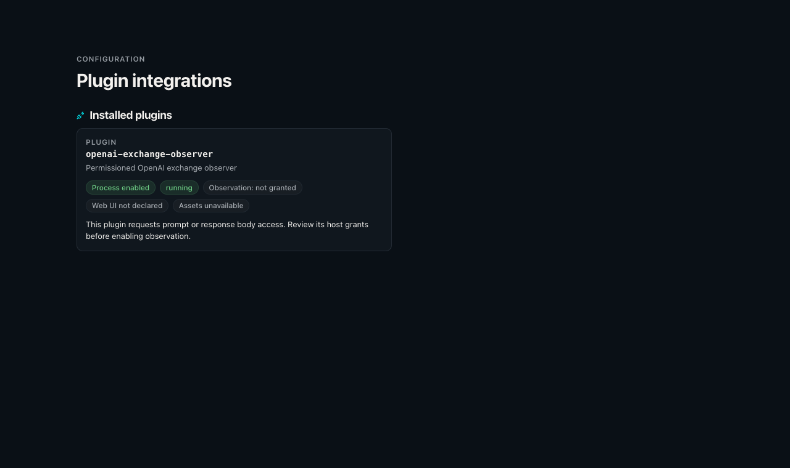

# OpenAI plugin lifecycle acceptance

Issue: [#1331](https://github.com/Mesh-LLM/mesh-llm/issues/1331).
Initial audit: `adf85a8142cc2fc27d038e6500c5b4a53d755b71`, 2026-10-04.
Merged upstream base: `9ca2aacaa698746becc811ec304d19de788c9d1e`.
The [normative v1 contract](openai-exchange-lifecycle.md) defines behavior. This
matrix records implementation and verification separately; pending checks are
not acceptance proof.

After merging the Mesh/Skippy split, all-target tests passed for seven affected
crates: 250 config, 3,657 host including integration targets, 48 identity, 61
plugin including the exemplar, 57 package-manager, 325 inference API, and 902
serving tests. Together they passed 5,300 tests with 30 ignored. The host
library passed 3,632 tests with 25 ignored; serving had five ignored. UI type
checking and all 1,835 tests passed, with three skipped.
Warnings-denied all-target Clippy passed for these crates and the shipped
MeshLLM binary. The CI definition suite passed 1,978 tests with 15 expected
skips, and all repository consistency checks passed. The rebuilt packaged
exemplar passed all four receiver tests and all 16 installed conformance
tests against the merged layout.
Formatting, Justfile, and diff checks passed. Review regressions cover pending
terminal callbacks after body drop, independent response negotiation deadlines,
configured-executable identity binding, canonical signing keys, credential
header filtering, bounded exemplar retention, and custom Cargo target paths.

These are local source/package results. The linked pull request records
subsequent composed product builds and remote CI results. The checks above
alone do not establish those results.

| Acceptance | Implementation | Verification |
| --- | --- | --- |
| Installed plugin inspects and denies chat | Private service, packaged child, real loopback ingress | Passed installed denial fixtures; zero backend dispatch |
| Stable denial OpenAI error | Raw/typed ingress admission, deny-wins result | Host unit suite and installed denial/error-shape fixtures passed |
| Allow preserves request bytes | Read-only decisions; exact body side streams | Installed backend byte recorder and independent receipt checks passed |
| Effective request and selected route | Raw selected admission; typed prepared admission after defaults; prepared pipeline/virtual dispatch | Prepared denial regression and installed planner/strong/virtual dispatch checks passed |
| Terminal outcomes | Shared host observation and frontend terminal guards | Host/frontend/Skippy suites and installed success/invalid/deny/error/timeout/cancel fixtures passed; focused exhaustion and actual failed-denial-write regressions passed |
| Independent byte digests | Final emitter SHA-256, entity framing observer | Wire vectors, installed backend/client comparisons, and independent receiver receipt checks passed |
| Live streaming, no reorder or rewrite | Ordered bounded copies; authenticated raw byte side streams; gated backend tail | Receiver tests and installed client-frame/observer-progress checks before tail release passed |
| Overflow/disconnect incomplete | Observer queue and completeness flags; independent healthy recipient | Host unit suite and installed overflow/disconnect isolation fixtures passed |
| Sensitive headers absent | Safe-name validator and explicit header intersection | Config tests and installed credential-header checks passed |
| Body access explicit | Manifest requests and separate operator grants | Negotiation and installed no-body/body/large-request fixtures passed |
| Identity permission enforced | Authenticated public/private RPC registration and grants | Identity/host suites and installed permission-denial RPC checks passed |
| Public bundle independently verified | Ownership and release evidence projection | Identity verifier tests and installed public bundle/delegation checks passed; production release provenance remains separate |
| Owner delegation without private material | Fixed public claim, bounded setup-time issuance | Identity signature/public DTO tests and installed issuance/reuse checks passed |
| Claims bound to host metadata | Captured executable digest, current installed registration, owner/node certificate | Independent claim tamper/binding tests and installed artifact-replacement checks passed |
| Arbitrary signing rejected | Fixed domain, scope enum, strict request schema | Fixed claim/lifetime tests and authenticated installed scope/lifetime/claim rejection checks passed |
| Renewal and invalidation | Registry tracks expiry, rotations, grant revocation | Host registry suite and installed artifact/grant revocation checks passed |
| Identity states distinct | Missing/unverified/verified/expired/revoked/invalid enum | Identity status/revocation tests and installed verified/missing/invalid/revoked evidence checks passed |
| Multiple plugins aggregate | Concurrent shared deadline, deny wins, bounded failures | Host permutation suite and two-installed-recipient order/fault fixtures passed |
| Local and tunneled observations | Shared ingress seam; real QUIC connection between two fixture nodes | Installed local/QUIC fixtures passed with fake inference backends |
| Old generation-3 plugins operate | Additive manifest field and service kind; child mode omitting lifecycle declaration | Old protobuf decode and installed legacy-operation handshake checks passed; separately released old host unqualified |
| Unsupported host fails clearly | Required lifecycle initialization rejection when host omits capability | Negotiation and installed old-capability handshake checks passed |
| Maintained exemplar | Generic Rust plugin, manifest/package recipes, authenticated receipt receiver | Rebuilt package, installed startup/conformance, and both receiver tests passed |
| Author/security documentation | Normative contract, grant reference, exemplar and wire vectors | Source audit completed and final local results recorded here |
| Owner grant revocation applies live | Persisted owner apply refreshes grant registry and cancels copies even when the command waiter is cancelled; startup installs current grants under apply serialization | Host grant suite, concurrent/cancelled-command/startup persisted-revocation regressions, and installed manager-reduction fixtures passed; full owner API apply integration remains outside these fixtures |

Installed conformance requires `just package-openai-exchange-exemplar` and an
explicit ignored-test invocation. A missing package fails the test. The
fixtures live under
`mesh/crates/mesh-llm-host-runtime/src/network/openai/ingress/`:

- `live_tests.rs`: installed child through the real plugin manager and raw
  loopback ingress, all three endpoints buffered/streaming, no-body model
  denial, large request admission, exact original/effective/response digests
  and independent receiver receipts, sensitive headers, faults, cancellation,
  two-recipient deny aggregation/isolation, and live grant reduction.
- `live_streaming_tests.rs`: a gated backend tail proves that both the client
  receives an SSE frame and the installed observer receives bytes before
  backend completion.
- `typed_frontend_live_tests.rs`: real Axum TCP router with the production
  composite policy and hook wrapper; three-endpoint denial, streamed
  chat/Responses commitments, and completion error outcomes. The completion
  mock explicitly implements the native prepared-admission/terminal seam.
- `prepared_dispatch_live_tests.rs`: prepared planner/strong pipeline
  admission with no denial fallback, independent backend-byte digests, and
  virtual dispatch admission over the actual serialized plugin invocation.
- `live_identity_tests.rs`: actual installed identity RPCs, permission denial,
  delegated-key signature verification, reuse, scope/lifetime/claim rejection,
  artifact replacement, and grant revocation.
- `live_tunnel_tests.rs`: real QUIC ingress between two fixture nodes,
  streaming evidence, and denial before backend dispatch.
- `compatibility_live_tests.rs`: installed child against an old-capability
  generation-3 control handshake.

These tests use controlled fake inference backends and an optional virtual
echo service. They do not qualify real GPU inference, deployment across
physical hosts, performance overhead, or release packaging.

Execution outcome and evidence completeness are independent. Missing optional
identity evidence is expected absence; an internal hook fault has a different
reason. Gateway records describe gateway observations. Software identity and
release provenance do not establish hardware execution attestation.

The Unix compatibility process fixtures in `ingress/compatibility_live_tests.rs`
launch the installed executable against a purpose-built generation-3 host
handshake with no lifecycle capability. The hidden exemplar
`--legacy-conformance` mode omits the lifecycle declaration and runs an ordinary
operation; normal required mode must return an actionable initialization error.
Both fixtures passed against the rebuilt archive. They do not establish
interoperability with a separately released host binary.

## UI review fixture

The actual plugin card rendered with a running external observer that requests
body access and has no observation grant. A representative status fixture
supplies the card data.

