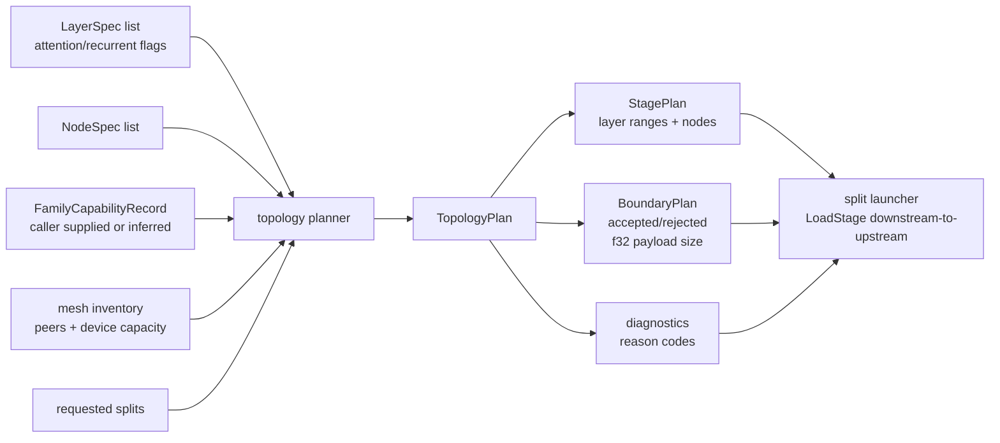
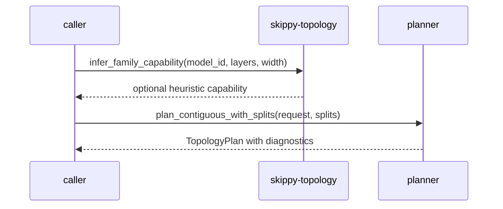

# skippy-topology

Topology planning and model-family capability policy.

`skippy-topology` turns model layers, node capacity, requested split points,
and optional family capability records into a validated stage plan. It is a pure
Rust planning crate: no model loading, process launching, sockets, telemetry, or
GGUF writing.

## Architecture Role

The standalone Skippy CLI and benchmark flows ask this crate whether a split plan is
acceptable before slicing models or starting servers. Mesh production split
placement uses the separate resource-based coordinator planner. This crate's plan carries
stage ranges, peer/device placement, boundary decisions, payload sizing, and
diagnostics.

## Family Policy Flow

Callers may supply an explicit capability record from inspected model metadata.
Identity inference is an advisory fallback, not a certification source or a
runtime substitute for the loaded model's capabilities.

## Responsibilities

- validate contiguous layer ranges and split boundaries
- produce even contiguous plans or explicit split plans
- classify stages as stateless, attention-KV, recurrent, or mixed
- reject family-forbidden boundaries such as shared KV producer/consumer cuts
- report fixed-f32 activation payload sizing
- infer advisory capabilities for known dense/recurrent families

Use this crate before `skippy-package-builder`, mesh stage deployment,
`skippy plan-split`, or `skippy-bench` commits to a runnable stage layout. When new
peers or devices make a better split possible, mesh replans by preparing the
replacement topology, waiting for readiness, and only then publishing the new
stage-0 route.
